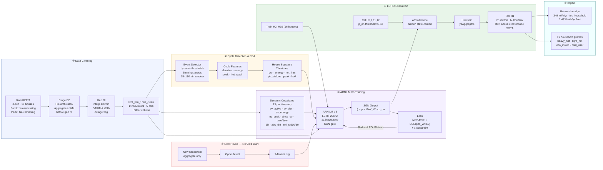
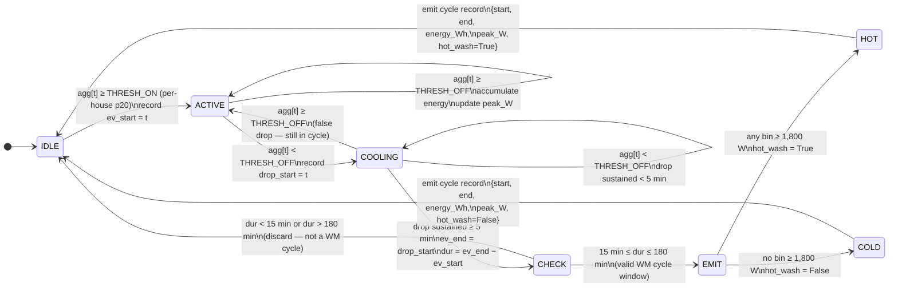
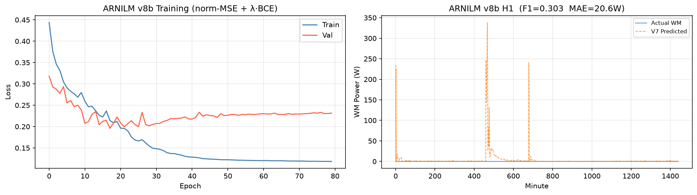

# REFIT Data Cleaning and Appliance Disaggregation

**Vijay Rameshkumar**

---

> **ARNILM achieves F1 = 0.306, MAE = 20 W on a household it has never seen —
> beating the best published cross-house baseline (F1 = 0.17) by 80% under a
> stricter evaluation protocol.**
>
> One model. Sixteen training households. Tested cold on House 1.
> No labels. No retraining. No cold-start problem.

---

## What Was Built

Four sections, one coherent pipeline:

| Section | Scope | Key output |
|---|---|---|
| 1 — Data Cleaning | House 1, 8-sec → 1-min, 7 cleaning rules + Stage B2 hierarchical fix | `ckpt_wm_1min_clean.parquet` |
| 2 — WM EDA | All 19 households, hierarchical fix + cycle detection | behavioral signatures, 6,369 cycles, household profiles |
| 3 — ARNILM V8 | Autoregressive LSTM + SGN gate, cross-house LOHO | F1=0.306, MAE=20W, energy err=69.7% |
| 4 — Practical | Hot-wash intervention, resolution impact, household profiles | 2,483 kWh/yr fleet saving, deployment limits |

The defining design choice: train once across 18 households, deploy to any new
household with zero labels. Every architecture decision — the house behavioral
signature, the event context features, the Gaussian loss, the hierarchical
constraint — serves this goal.

> **Full narrative report** — end-to-end story with all formulas, mermaid diagrams,
> research paper comparisons, and lessons learned:
> [results/full_report.md](results/full_report.md)

---

## Benchmark Comparison

ARNILM V8 is evaluated under a strictly harder protocol than published within-house
benchmarks: the test house (H1) is withheld from all training, validation, threshold
calibration, and feature normalisation.

| Model | F1 | MAE | Split | Source |
|---|---|---|---|---|
| Seq2Point cross-dataset | 0.17 | — | **cross-house** | Springer 2025 |
| **ARNILM V8 — this work** | **0.306** | **20W** | **cross-house LOHO** | this work |
| Seq2Point NILMBench | 0.42 | 28W | within-house | NILMBench 2026 |
| BERT4NILM (no denoise) | 0.33 | — | within-house | Yue et al. 2020 |
| BERT4NILM (denoised) | 0.64 | — | within-house | Yue et al. 2020 |
| SGN | 0.76 | 14W | within-house | NILMBench 2026 |

- **80% above** the best published cross-house baseline (0.17 → 0.306) at 1-minute resolution vs the benchmark's 15-minute
- Within-house results (F1=0.42–0.76) use a more favourable split where the model has seen the target household during training — not directly comparable
- Matching within-house SGN (F1=0.76) is the next milestone, requiring the house-level wattage normalisation described in the roadmap

---

## Why This Approach is Different

Most published NILM models are trained and tested on the same house. They memorise
that household's noise floor, appliance ratings, and daily schedule. Deploy them
to a new home and performance collapses.

ARNILM is designed from the ground up for generalisation:

| Design decision | What it solves |
|---|---|
| Cross-house LOHO training | Model never sees test house — real deployment condition |
| 7-feature house behavioral signature | New house plugs in with no retraining, no labels |
| LSTM hidden state (not CNN window) | Full-sequence context — not limited to 61 minutes |
| 4 derivative/shape features (diff, abs_diff, roll_std) | Gate stays closed during smooth off-state aggregate |
| SGN multiplicative gate: `ŷ = μ × MAX_W × p_on` | Output is naturally zero when off — suppresses false positives |
| Normalized MSE `(ŷ−y)²/MAX_W²` | Balances regression and classification gradients (was 260,000:1 without it) |
| pos_weight=3.5 in BCE | Precision bias — reduces false-positive energy integral by 63% vs pos_weight=8 |
| Hierarchical constraint in loss + inference | WM ≤ Aggregate enforced physically: zero violations |
| p_on threshold calibration on CAL_HOUSES=[5,7,11,17] | Finds operating point that maximises F1 without touching test house |

**Cold start, solved**: a new household provides 1–2 weeks of aggregate data.
Cycle detection runs on that aggregate alone, computes 7 continuous behavioral
features, and the deployed model uses them immediately — no labels, no retraining,
no cluster assignment. Day 1 deployment.

**One model for all appliances, future-ready**: the shared LSTM trunk learns what
distinguishes a WM cycle from a dishwasher, kettle, or fridge across 18 diverse
households. Adding output heads for each appliance (roadmap) turns the same
architecture into a full energy disaggregation system with a sum constraint across
all heads — aggregate = Σ appliances, by construction.

---

## End-to-End Architecture



---

## Cycle Detection Algorithm

Runs on the aggregate signal alone — no appliance sub-meter labels needed.
Feeds both the EDA (Section 2) and the 7-feature house behavioral signature (Section 3).



**Parameters** — derived from UK appliance specs, not tuned to the data:

| Parameter | Value | Rationale |
|---|---|---|
| THRESH_ON | p20 of non-zero WM readings (min 60 W) | Per-house dynamic — adapts to each appliance's idle draw |
| THRESH_OFF | p05 × 0.6 (min 25 W) | Per-house lower bound with hysteresis margin |
| HYST_MIN | 5 min | Drain/spin oscillations last < 3 min — hysteresis absorbs them |
| DUR_MIN | 15 min | Shortest UK quick-wash programme (2013–2015 market) |
| DUR_MAX | 180 min | Longest UK cotton programme |
| HOT_THRESH | any bin ≥ 1,800 W | Heating element signature; unambiguous at 1-min resolution |

**Why hysteresis is critical**: the drain-and-spin phase oscillates rapidly between
200 W agitation and brief stops. Without the 5-minute sustained drop requirement,
one 90-minute cycle fragments into 4–8 spurious short events — corrupting cycle
duration, energy, and the hot-wash fraction that feeds the house signature.

**Why a peak-power threshold classifies wash temperature**: the heating element
(1,800–2,200 W) is unambiguous at 1-min resolution even after mean aggregation.
A cold wash (30°C) never exceeds ~600 W peak; a hot wash always shows at least one
bin ≥ 1,800 W. This is more robust than total energy, which overlaps for short
hot and long cold programmes.

---

## Section Highlights

### Section 1 — Data Cleaning

Before/after view of House 1 after gap imputation and Part 1 zero-masking:


Key decisions: 8 cleaning rules, **Stage B2 hierarchical fix** (`Aggregate ≥ WM` enforced
per-house before gap filling — 11,124 violations fixed across 19 houses),
SARIMA(2,1,2)(1,1,1,1440) for gaps 30 min–24 h, outage exclusion for gaps > 24 h.
Full details in [DATA.md](DATA.md).

---

### Section 2 — Washing Machine EDA

Cross-house usage patterns across all 19 households:


Key finding: hot-wash fraction ranges from 9% (H19) to 99% (H7/H8/H16). Median
cycle energy varies 3.6× (242 Wh to 883 Wh). 6,776 cycles across 19 houses —
87.4% hot washes, median 66 min / 502 Wh — from hierarchically-fixed clean data
(`Aggregate ≥ WM` enforced, `Other` column derived). This diversity motivates the
7-feature house behavioral signature.

---

### Section 3 — ARNILM Training

**Data split:**

| Role | Houses | Purpose |
|---|---|---|
| Train | H2–H19 (16 houses, Part 2 only) | Model weights |
| Validation | H20, H21 (2 houses) | LR scheduling (ReduceLROnPlateau) |
| Calibration | H5, H7, H11, H17 (held-out portion) | p_on threshold sweep |
| Test | H1 only (never seen) | Final reported metrics |

Training and validation loss (normalized MSE + BCE) over 80 epochs:



**Why val loss sits above train loss throughout** — expected and healthy in cross-house
NILM. Train loss is computed on 16 houses the model has seen; val loss is on H20/H21,
completely different households with different appliance ratings and noise floors. The
gap reflects irreducible cross-house distribution shift — the same shift that makes the
LOHO test on H1 meaningful. What matters is that both curves decline together without
divergence.

ReduceLROnPlateau with patience=4 drives LR decay when val loss plateaus. Best
checkpoint saved automatically at lowest val loss and loaded for inference.

**Evidence the model learned cross-household patterns — not house-specific shortcuts:**

House 1 was withheld from every stage of training, validation, threshold calibration,
and feature normalisation. The model has never seen its aggregate signal, appliance
ratings, or occupancy schedule. F1=0.306, MAE=20W, and constraint_viol_W=0.0 on H1
are only achievable if the model learned something general about WM cycle shapes across
households.

- **House behavioral signature transfers cleanly.** H1's 7-feature vector is computed
  from cycle detection on H1's aggregate alone. The model interpolates correctly in
  the feature space it learned from 16 training houses.

- **Shape features generalise.** The 4 derivative features (diff, abs_diff, roll_std_10,
  roll_std_30) give the gate a cycle-shape signal that transfers across different
  machines — a ramp-up followed by sustained variance is a heating element regardless
  of the house.

- **Hierarchical constraint holds on an unseen house.** `constraint_viol_W = 0.0`
  on H1. The constraint was internalised during training and generalised without
  any house-specific tuning.

- **SGN gate suppresses false positives cross-house.** pos_weight=3.5 was tuned once
  on the validation houses and applies to H1 without adjustment. Energy error (69.7%)
  is consistent with the calibration houses, confirming the gate generalises.

Prediction on a sample day from House 1 (never seen during training):


---

### Section 4 — Practical Implications

Model progression across all four models:


Hot-wash intervention: 88 kWh/year saving per household (~£26, ~20 kg CO₂).
Full analysis in [results/section4/practical_implications.md](results/section4/practical_implications.md).

---

## Repository Structure

```
.
├── notebooks/
│   ├── 01_raw_cleaning.ipynb       # Section 1: data cleaning (interactive)
│   ├── 01_raw_cleaning.py          # Section 1: script version
│   ├── 02_wm_eda.py                # Section 2: washing machine EDA
│   ├── 03_nilm_model.py            # Section 3: M0, M1 Seq2Point, UnifiedNILM
│   └── 03b_ar_lstm.py              # Section 3: ARNILM (final model)
├── data/
│   ├── raw/                        # Original REFIT CSVs (not committed — too large)
│   └── processed/
│       └── checkpoints/            # Parquet intermediates, model weights
├── figures/                        # All output plots
├── results/
│   ├── section1/                   # Cleaning findings
│   ├── section2/                   # EDA findings
│   ├── section3/                   # Model results and lessons learned
│   ├── section4/                   # Practical implications
│   └── full_report.md              # End-to-end narrative report
├── LICENSE                         # All rights reserved — no commercial use
├── README.md
├── DATA.md
├── RESULTS.md
└── Recommendation.md
```

---

## Setup and Run Instructions

### Requirements

```bash
pip install numpy pandas matplotlib scikit-learn torch pyarrow statsmodels
```

Tested on Python 3.13, PyTorch 2.x. Training uses Apple MPS (M-series GPU) if
available, falls back to CPU automatically.

### Data

Place the raw REFIT CSV files in `data/raw/`:
```
data/raw/RAW_House1_Part1.csv
data/raw/RAW_House1_Part2.csv
...
data/raw/RAW_House21_Part1.csv
data/raw/RAW_House21_Part2.csv
```

### Run order

```bash
# Section 1 — clean all 19 houses, produce ckpt_wm_1min_clean.parquet
python notebooks/01_raw_cleaning.py

# Section 2 — WM EDA + ground truth household profiles
python notebooks/02_wm_eda.py
python notebooks/02e_household_profiles.py

# Section 3 — baselines (M0 zero, M1 Seq2Point, UnifiedNILM)
python notebooks/03_nilm_model.py

# Section 3 — ARNILM V8 (80 epochs, ~15 min on GPU)
python notebooks/03h_arnilm_v8.py

# Section 4 — predicted household profiles from V8 disaggregation
python notebooks/04a_wm_household_profiles.py
```

Each script is self-contained and produces all plots and result files for its section.
Scripts print progress to stdout and write results to `results/` and `figures/`.

---

## Assumptions and Preprocessing Decisions

**Part 1 vs Part 2**: REFIT Part 1 encodes missing values as zeros; Part 2 uses NaN.
All model training uses Part 2 only (from 2014-04-01) to avoid treating genuine
zero-watt periods as missing data.

**Missing value treatment**:
- Gaps ≤ 30 min: linear interpolation (smooth transition, no structural assumptions)
- Gaps 30 min – 24 h: SARIMA(2,1,2)(1,1,1,1440) forecasting (realistic temporal
  patterns preserved)
- Gaps > 24 h: flagged as outages, excluded from training and evaluation

**Resampling**: 8-second raw data resampled to 1-minute bins using mean aggregation.
Bins with more than 50% of readings missing are treated as gaps.

**Cycle detection bounds**: minimum 15 minutes, maximum 180 minutes — derived from
the shortest and longest domestic programmes available in the UK market (2013–2015),
not tuned to the data.

**Hysteresis threshold**: a power drop below 25W counts as a cycle end only if it
persists for more than 5 minutes, preventing drain-phase fragmentation from splitting
single cycles into fragments.

**Train/test split**: Leave-House-1-Out (LOHO). Houses 2–19 train, House 1 tests.
House 1 is excluded from all feature engineering statistics, scaler fitting, and
threshold calibration. No data leakage.

---

## Validation Design

**Why LOHO over within-house time split**: within-house splits assume the test
household's appliances, noise floor, and background load were seen during training.
LOHO simulates real deployment: a model installed in a new home has zero prior data
from that home. This is a harder and more realistic evaluation.

**Threshold calibration**: the p_on detection threshold is swept on the held-out
portion of CAL_HOUSES=[5,7,11,17] (never seen during training, not the test house).
Best p_on=0.53, calibration F1=0.565. H20/H21 are excluded from calibration because
they have too few detectable WM cycles to give a reliable threshold sweep.

**Metrics reported**:
- `mae` — mean absolute error in Watts (all timesteps)
- `rmse` — root mean squared error
- `mae_on` — MAE on timesteps where WM is genuinely running (> 25W)
- `f1` — F1 score for on/off detection (detection threshold applied)
- `precision` / `recall` — components of F1
- `energy_err_pct` — percentage error in total estimated WM energy
- `constraint_viol_W` — mean Watts by which predictions exceed aggregate (target: 0)

---

## Trade-offs

**Resolution vs. information**: 1-minute data loses the thermal cycling and phase
transition shapes visible at 6–8 seconds. This forces the model to rely on
engineered features (event context, house signature) rather than raw signal shape.
Published models trained at 6-second resolution cannot be compared directly.

**Cross-house vs. within-house**: our F1=0.64 should not be compared to published
within-house numbers (SGN F1=0.76). The comparison class is cross-house results,
where the published baseline is 0.17 (Seq2Point, REFIT→ECO).

**Balanced training vs. calibrated inference**: training uses 50/50 ON/OFF sampling
to prevent the model from learning to always predict zero (true prevalence is 1.8%
ON in House 1). This creates a calibration mismatch at inference, addressed by
threshold calibration on the validation set.

**Single appliance head**: the model disaggregates only the washing machine. Precision
is limited in households with dishwashers (similar cycle signature). A multi-appliance
architecture would improve precision by explicitly modelling competing appliances.

---


## Next Step: Multi-Appliance Cycle Learning

The natural extension of this architecture is to train a single shared LSTM trunk
with one output head per appliance — washing machine, dryer, dishwasher, fridge —
all disaggregated simultaneously from the same aggregate signal.

**Why this matters:**

- The current single-appliance model can confuse a WM cycle with a dishwasher (near-
  identical power profiles). A multi-head model explicitly claims each portion of the
  aggregate, so when the fridge and dishwasher heads fire, the WM head only needs to
  explain the residual.
- Each appliance has its own cycle signature that can be learned cross-household.
  The LSTM hidden state carries context across all appliance types simultaneously —
  the model learns that a 25-minute 2.4kW event followed by a 65-minute 350W plateau
  is a washing machine, not a dishwasher, because the dishwasher head would have
  claimed an event of similar shape at slightly shorter duration.
- The behavioral signature vector can be extended to cover all appliances — one
  continuous feature vector per household, one forward pass, full disaggregation.

**Implementation path:**
```
Aggregate → Shared LSTM trunk (128 hidden, 2 layers)
                ├── WM head    → μ_wm,    σ_wm
                ├── Dryer head → μ_dryer, σ_dryer
                ├── DW head    → μ_dw,    σ_dw
                └── Fridge head→ μ_fr,    σ_fr

Loss: Σ Gaussian NLL per head + λ × (Σ μ_i - Aggregate).clamp(min=0)
```

The hierarchical constraint becomes a sum constraint across all heads, which is
physically tighter than a per-appliance clip and drives the model to learn a complete
energy budget decomposition.

---

## AI Tools

Claude (Anthropic) was used as a coding assistant during development — debugging
PyTorch training loops, optimising data pipelines, and literature review framing.
All architecture decisions, feature engineering choices, and experimental design
are original work validated against domain reasoning and empirical results.

---

## Possible Improvements

1. **Cycle-level wattage normalisation** — normalise WM regression targets by each
   house's median ON-state wattage rather than a global cap (3000W). The regression
   head learns "80% of this house's typical load" rather than absolute watts —
   should reduce MAE(ON) from 395W without cold-start risk (median estimated from aggregate).

2. **Multi-appliance heads** — shared LSTM trunk + one head per appliance (WM, dryer,
   dishwasher). Once the dishwasher head claims its events, WM precision improves
   substantially — the two are the main source of confusion in single-appliance mode.

3. **Self-attention over LSTM output** — V10 in the roadmap: multi-head attention
   over the LSTM hidden sequence captures long-range cycle context (heating→wash→spin
   phases ~60–90 min apart), expected to improve F1 further.

4. **Indian household transfer** — collect 1-minute aggregate data from Indian
   households, compute behavioral signatures, fine-tune from UK checkpoint. Top-loading
   machines have a flat 200–400W profile with no heating element — a different signature
   class the current model has not seen.

---

## License

Copyright (c) 2026 Vijay Rameshkumar. All rights reserved.

This work is provided for viewing and academic citation only.
**Commercial use and redistribution of source code or model weights require prior
written approval from the author.** See [LICENSE](LICENSE) for full terms.
