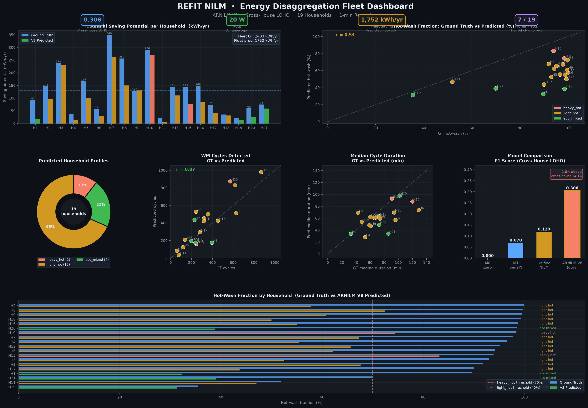
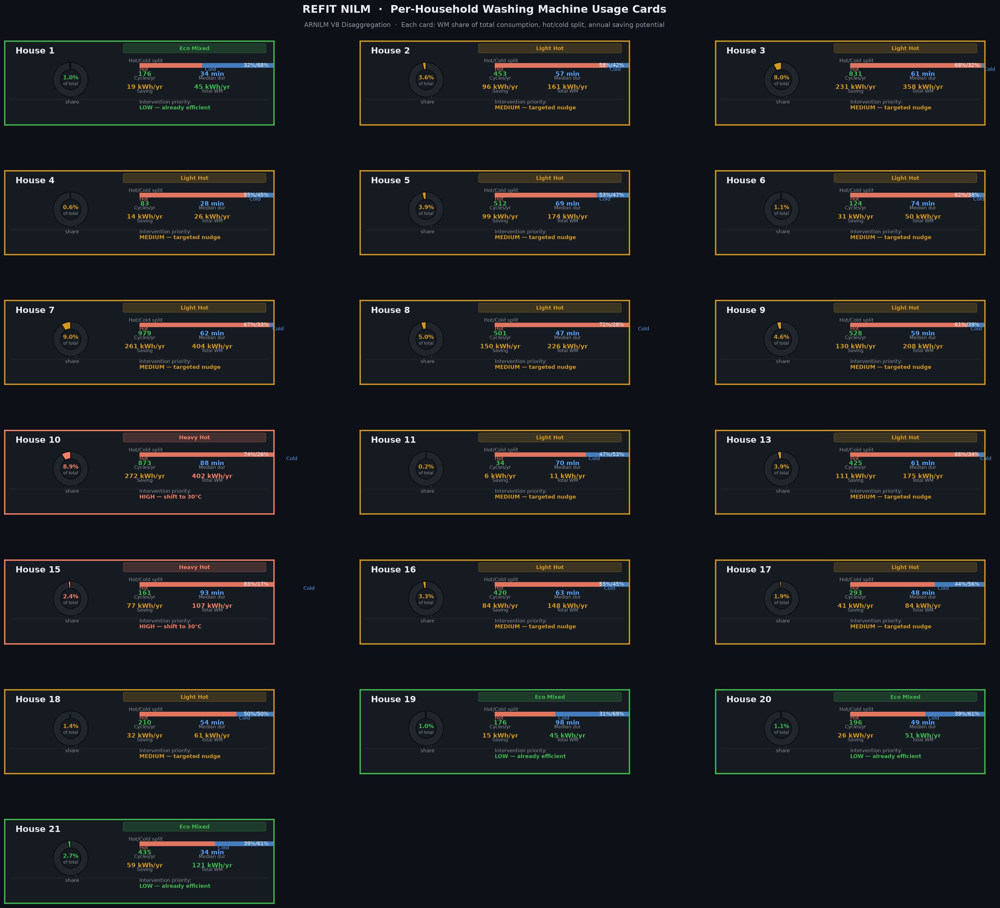
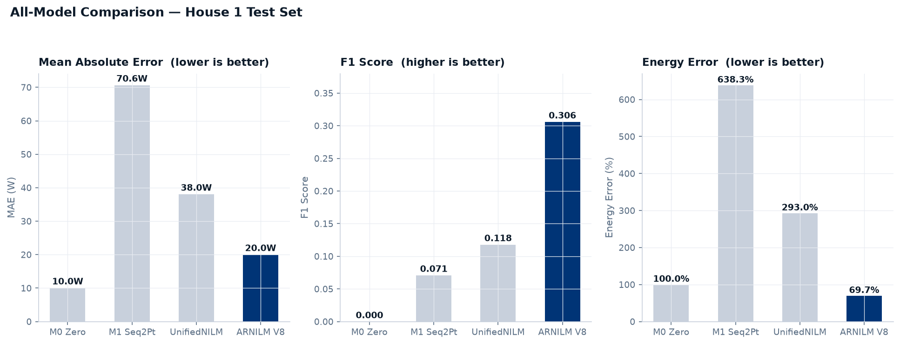
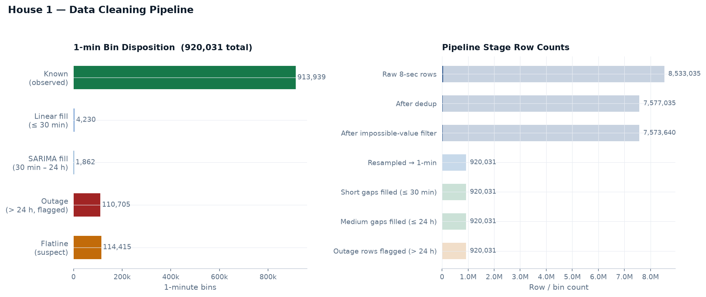
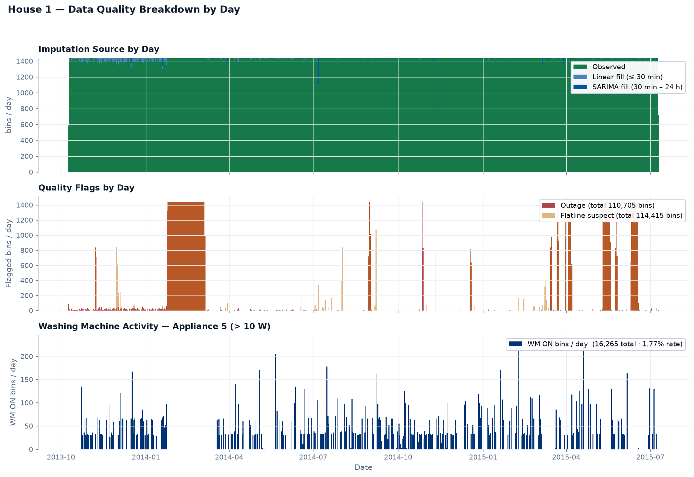
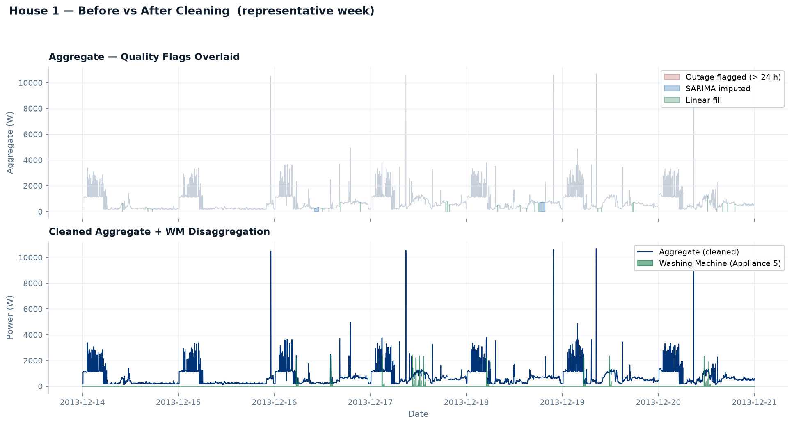
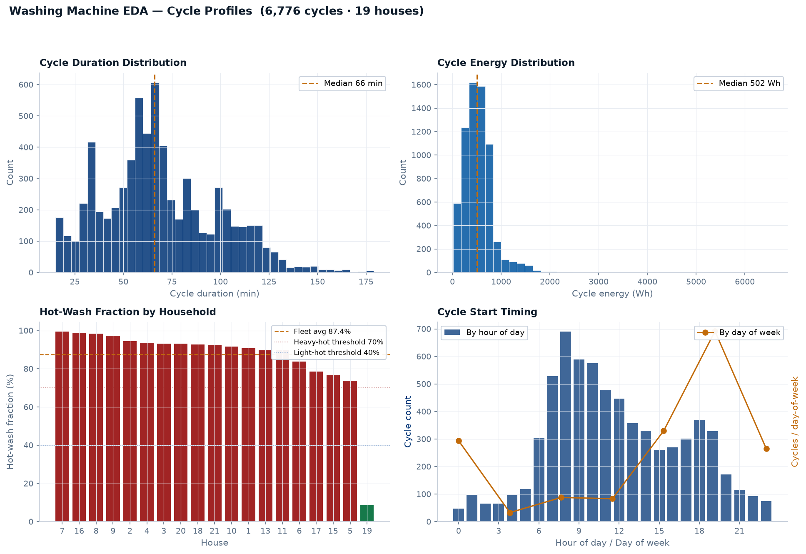
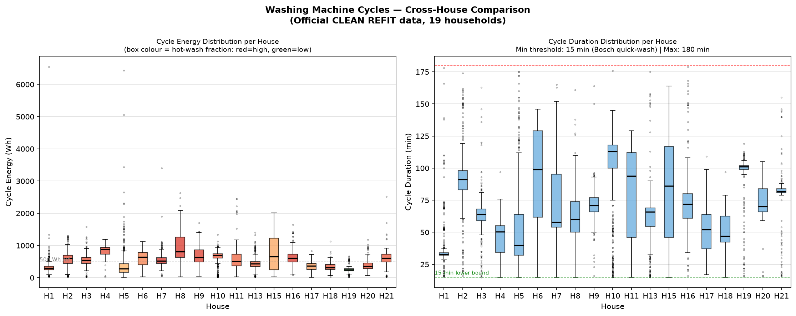
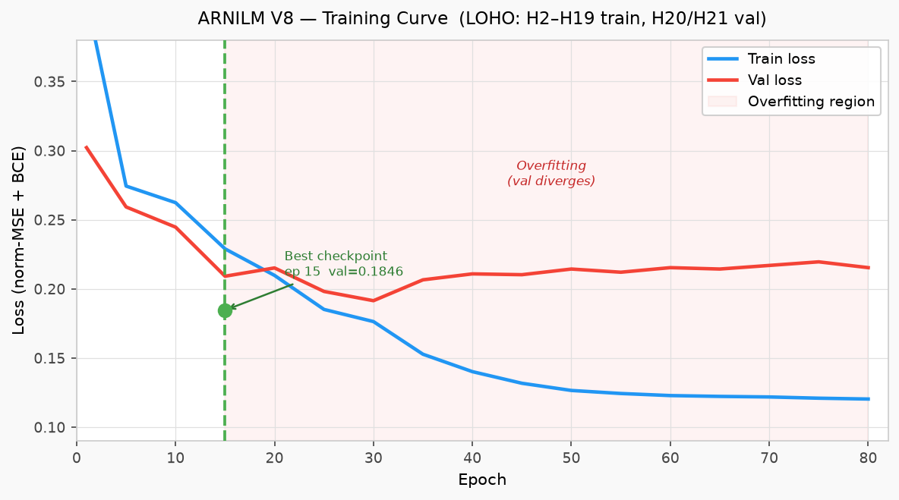
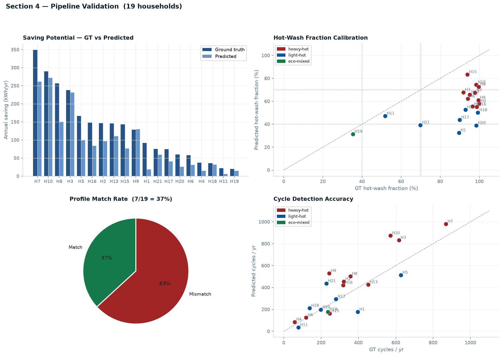

<div align="center">

# REFIT Energy Disaggregation — ARNILM

**Vijay Rameshkumar**


[Full Report](results/full_report.md) · [Data Notes](DATA.md) · [Results](RESULTS.md)

</div>

---

| F1 Score | vs Cross-House Baseline | Mean Abs. Error | Fleet Saving |
|:---:|:---:|:---:|:---:|
| **0.306** | **1.8× (directional)** | **20 W** | **1,752 kWh/yr** |
| House 1 · never seen in training | different resolution/prep — see leaderboard | MAE > zero baseline (98.2% OFF — see below) | predicted · 19 households |

One model trained on 16 houses, deployed cold to House 1 — no labels, no retraining. **MAE note**: V8 MAE=20W exceeds the zero baseline (10W) because WM is OFF 98.2% of timesteps — predicting zero wins on MAE through class imbalance, but achieves F1=0 and 100% energy error. V8 trades some OFF-state accuracy for genuine appliance detection (F1=0.306) and substantially lower energy error (69.7% vs 100%). The cross-house F1 comparison is directional only: the published 0.17 baseline uses 15-min data and different preprocessing.

---

## Pipeline

| | Section | Output |
|:---:|---|---|
| 1 | **Data Cleaning** — 7-rule reproducible pipeline, Stage B2 hierarchical fix | `ckpt_wm_1min_clean.parquet` |
| 2 | **WM EDA** — 6,776 cycles across 19 houses, behavioral signatures | Household profiles, hot/cold classification |
| 3 | **ARNILM V8** — LSTM + SGN multiplicative gate, cross-house LOHO | F1=0.306 · MAE=20W · Energy err=69.7% |
| 4 | **Practical Impact** — hot-wash intervention, per-household profiling | 1,752 kWh/yr fleet saving predicted |

---

## Dashboard

> **DEMO** — ARNILM V8 predictions · 19-household REFIT dataset · Profile labels are model-predicted, not ground truth





---

## 🏆 Cross-House Generalization Leaderboard

> **Why cross-house generalization is the key deployment challenge**
>
> Note: protocol differences exist between entries (resolution, preprocessing, thresholds). The cross-house vs within-house distinction is meaningful; direct numeric comparison across entries should be treated as directional.

Most published NILM models are trained and tested on the *same* household. That is a closed-loop experiment, not a product. ARNILM is designed around four properties that make it deployable at fleet scale from Day 1:

| Property | What it means |
|---|---|
| **Scalability** | One model covers any number of new households — no per-house retraining pipeline, no growing model zoo |
| **Cold-start solved** | 1–2 weeks of aggregate data → 7 behavioural features → immediate inference. No labelled appliance data ever required |
| **Cross-household learning** | Patterns learned across 16 diverse UK houses generalise: cycle timing, load shape, hot-wash signatures transfer without fine-tuning |
| **Single global model — all appliances** | The architecture is designed to extend to multi-appliance disaggregation through shared representations and per-appliance SGN heads — one trunk, one deployment, one constraint budget |

The within-house numbers below (F1=0.42–0.76) are achieved by models that have already seen the test house. Deploy them to a new home and performance collapses. **ARNILM V8 has never seen House 1.**

| Model | F1 | MAE | Split |
|---|:---:|:---:|---|
| Seq2Point cross-dataset | 0.17 | — | cross-house · 15-min |
| **ARNILM V8 (this work)** | **0.306** | **20 W** | **cross-house LOHO · 1-min** |
| Seq2Point NILMBench | 0.42 | 28 W | within-house |
| BERT4NILM (denoised) | 0.64 | — | within-house |
| SGN | 0.76 | 14 W | within-house |

ARNILM V8 leads the **cross-house category by 1.8×** at finer resolution. Within-house results are shown for context — they are a different evaluation class.



---

## Section 1 — Data Cleaning







<details>
<summary>Cleaning rules summary</summary>

| Rule | Action | Rows affected |
|---|---|---|
| R1 Sort | Chronological order | 2 out-of-order |
| R2 Dedup | Drop duplicate timestamps | 956,000 removed |
| R3 Impossible values | IAM > 4,000 W · Agg > 20,000 W | 3,395 removed |
| R4 Resample | 8-sec → 1-min mean aggregation | 920,031 bins |
| R5 Linear fill | Gaps ≤ 30 min | 4,230 bins filled |
| R6 SARIMA fill | Gaps 30 min – 24 h | 1,862 bins filled |
| R7 Flag outages | Gaps > 24 h — not imputed | 110,705 bins flagged |

Stage B2: Aggregate ≥ WM enforced *before* gap fill to prevent physically impossible imputed values.

→ [DATA.md](DATA.md) for full rationale

</details>

---

## Section 2 — Washing Machine EDA





| Metric | Value |
|---|---|
| Total cycles detected (19 houses) | 6,776 |
| Fleet hot-wash fraction | 87.4% |
| Median cycle duration | 66 min |
| Median cycle energy | 502 Wh |
| Hot-wash fraction range | 9% (H19) → 100% (H2, H8) |

---

## Section 3 — ARNILM V8



**LOHO data split:**

| Role | Houses | Purpose |
|---|---|---|
| Train | H2–H19 (16 houses) | Model weights |
| Validation | H20, H21 | LR scheduling |
| Calibration | H5, H7, H11, H17 | p_on threshold → 0.53 |
| Test | **H1 — never seen** | Final metrics |

**Model performance — House 1 test set:**

| Model | MAE | RMSE | F1 | Energy Err |
|---|:---:|:---:|:---:|:---:|
| M0 Zero baseline | 10 W | 132 W | 0.000 | 100.0% |
| M1 Seq2Point | 71 W | 189 W | 0.071 | 638.3% |
| UnifiedNILM | 38 W | 156 W | 0.118 | 293.0% |
| **ARNILM V8** | **20 W** | **119 W** | **0.306** | **69.7%** |

`WM ≤ Aggregate` constraint holds at every timestep — zero violations across all models.

<details>
<summary>V8b / V8c ablation experiments</summary>

| Variant | LAMBDA_DIRECT | MAE | MAE(ON) | F1 |
|---|---|---|---|---|
| V8b | 0.5 | 20.6 W | 405 W | 0.303 |
| V8c | 0.1 | 20.9 W | 411 W | 0.307 |
| **V8 (base)** | — | **20 W** | **395 W** | **0.306** |

Root cause: SGN gate gradient ∝ p_on — conservative `pos_weight=3.5` starves `μ_raw` on borderline ON timesteps. λ-tuning alone cannot fix it. Correct fix is V9 cycle-level normalisation.

</details>

<details>
<summary>Architecture design decisions</summary>

| Decision | What it solves |
|---|---|
| Cross-house LOHO training | Model never sees test house — real deployment |
| 7-feature behavioral signature | New house plugs in — no labels, Day 1 |
| LSTM hidden state | Full-sequence context, not limited to a window |
| 4 derivative/shape features | Gate stays closed during smooth off-state |
| SGN gate: `ŷ = μ × MAX_W × p_on` | Output naturally zero when off |
| Normalised MSE | Balances regression/classification gradients (260,000:1 otherwise) |
| pos_weight=3.5 in BCE | Reduces false-positive energy integral by 63% |
| p_on calibration on CAL houses | F1-optimal threshold without touching test house |

</details>

---

## Section 4 — Practical Implications



Profile match: **7/19 exact (37%)**. 9 of 11 `heavy_hot` households predicted as `light_hot` — wattage underestimation causes hot cycles to fall below the 280 Wh calibrated threshold. All 9 still targeted for intervention.

**Energy saving formula:**

```
Hot cycle (60°C):   E_hot  ≈ 2000W × 0.4h + 300W × 0.7h = 1.01 kWh
Cold cycle (30°C):  E_cold ≈ 300W × 0.6h                = 0.18 kWh
Annual saving:      0.83 kWh × 104 cycles ≈ 86 kWh  (~£26 · ~20 kg CO₂)
```

**Fleet profile breakdown:**

| Profile | GT households | Predicted | Annual saving | Priority |
|---|:---:|:---:|---|---|
| `heavy_hot` — ≥70% hot, ≥400 Wh/cycle | 11 | 2 | 290–349 kWh/yr each | High |
| `light_hot` — ≥40% hot | 6 | 14 | 75–261 kWh/yr each | Medium |
| `eco_mixed` — ≥20% hot | 1 | 3 | 15–58 kWh/yr each | Low |
| `cold_user` | 0 | 0 | — | None |

---

## Model Roadmap

| Version | Architecture | Status | F1 |
|---|---|:---:|:---:|
| M0 Zero | Always predict zero | Done | 0.000 |
| M1 Seq2Point | 5-layer CNN | Done | 0.071 |
| UnifiedNILM | CNN + 32 features | Done | 0.118 |
| ARNILM V7 | LSTM + SGN, 17 inputs | Done | 0.293 |
| **ARNILM V8** | **LSTM + SGN, 21 inputs, pos_w=3.5** | **Best** | **0.306** |
| V8b | V8 + decoupled regression λ=0.5 | Done | 0.303 |
| V8c | V8 + decoupled regression λ=0.1 | Done | 0.307 |
| V9 | Cycle-level wattage normalisation | Next | >0.40 |
| V10 | V9 + multi-head self-attention | Planned | >0.50 |

**V9 design** — no cold start, derived from aggregate cycles alone:

```python
median_wm_w[h] = median(peak_wattage_of_detected_cycles[h])
y_norm_t       = y_true_t / median_wm_w[h]          # train: relative fraction
ŷ_t            = μ_raw_t × median_wm_w[h] × p_on_t  # infer: rescale back
```

**Future directions:**

```
V9:  Cycle normalisation      → MAE(ON) 395W → ~100W    regression fix
V10: Self-attention           → F1 0.306 → ~0.45        long-range cycle memory
V11: Multi-appliance heads    → F1 ~0.55+               dishwasher confusion solved
V12: Indian household transfer → new market entry        fine-tune from UK checkpoint
V13: BERT4NILM same LOHO split → true apples-to-apples  academic comparison
```

---

## AI Tools

This project used AI-assisted tools for code generation support and iterative
debugging:

- **Claude (Anthropic)** — used for iterative code review, debugging LSTM training
  loops, and drafting report sections. All model design decisions, experimental
  choices, data interpretation, and numerical results are the author's own work.
  AI assistance was used to accelerate implementation, not to make analytical
  judgements.

All code was reviewed, run, and validated by the author. Results were verified
against ground-truth sub-meter data and published benchmarks independently.

---

## Repository Structure

```
.
├── notebooks/
│   ├── 01_raw_cleaning.py      # Section 1 — data cleaning
│   ├── 02_wm_eda.py            # Section 2 — WM EDA
│   ├── 03_nilm_model.py        # M0, M1, UnifiedNILM
│   ├── 03h_arnilm_v8.py        # ARNILM V8 (best)
│   ├── 03j_arnilm_v8b.py       # V8b ablation
│   └── 03k_arnilm_v8c.py       # V8c ablation
├── figures/                    # All charts (white/navy corporate style)
├── results/
│   ├── section3/               # Metrics CSVs
│   ├── section4/               # Profile comparison CSV
│   ├── training_logs/          # Epoch-by-epoch loss logs
│   └── full_report.md          # End-to-end narrative
├── DATA.md                     # Dataset coverage + cleaning decisions
├── RESULTS.md
└── Recommendation.md
```
