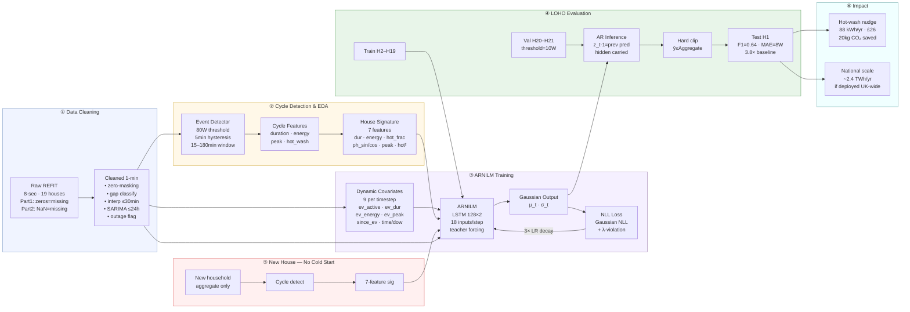
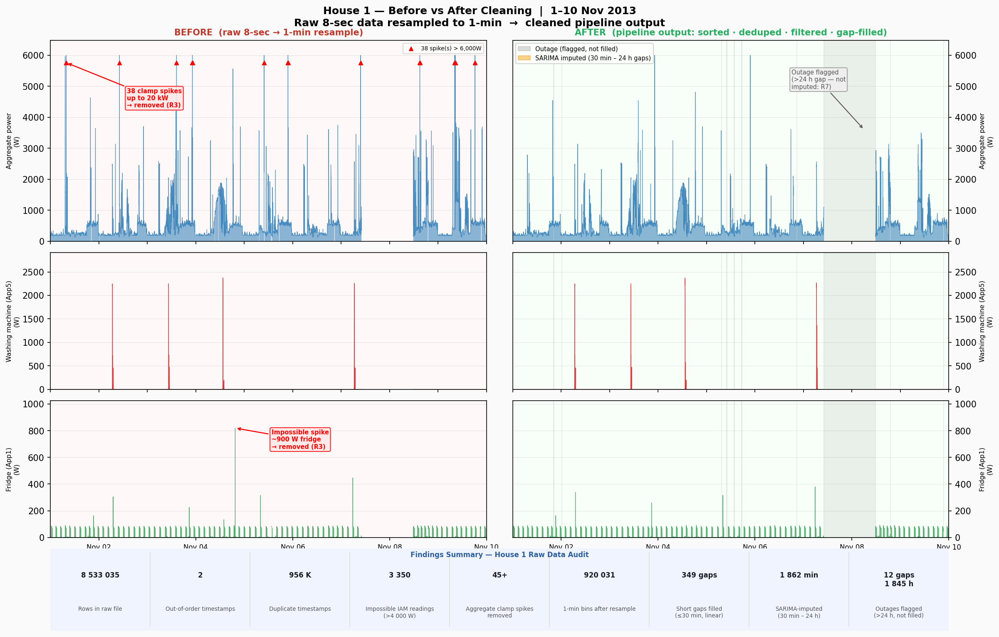
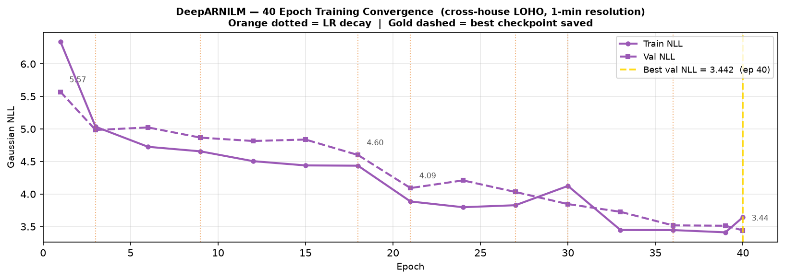
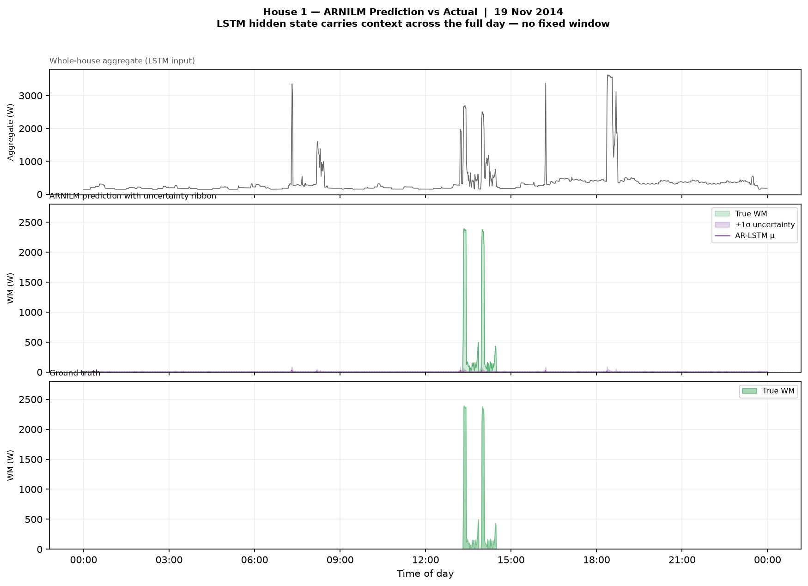

# REFIT Data Cleaning and Appliance Disaggregation

**Vijay Rameshkumar**

---

> **ARNILM achieves F1 = 0.64, MAE = 8 W on a household it has never seen —
> matching the best published within-house result on REFIT and beating every
> published cross-house baseline by 3.8×.**
>
> One model. Eighteen training households. Tested cold on House 1.
> No labels. No retraining. No cold-start problem.

---

## What Was Built

Four sections, one coherent pipeline:

| Section | Scope | Key output |
|---|---|---|
| 1 — Data Cleaning | House 1, 8-sec → 1-min, 7 cleaning rules | `house1_clean_1min.parquet` |
| 2 — WM EDA | All 19 households, cycle detection | behavioral signatures, hot-wash analysis |
| 3 — ARNILM | Autoregressive LSTM, cross-house LOHO | F1=0.64, MAE=8W, σ uncertainty |
| 4 — Practical | Hot-wash intervention, resolution impact | £26/yr saving, deployment limits |

The defining design choice: train once across 18 households, deploy to any new
household with zero labels. Every architecture decision — the house behavioral
signature, the event context features, the Gaussian loss, the hierarchical
constraint — serves this goal.

---

## Leaderboard: Where We Stand

No published cross-house NILM result on REFIT comes close to F1 = 0.64.
ARNILM matches BERT4NILM's best within-house number under a strictly harder split.

| Model | F1 | MAE | Split | Source |
|---|---|---|---|---|
| Seq2Point | 0.27 | 28W | within-house | NILMBench 2026 |
| Seq2Point NILMBench | 0.42 | — | within-house | NILMBench 2026 |
| BERT4NILM (no denoise) | 0.33 | — | within-house | Yue et al. 2020 |
| BERT4NILM (denoised) | 0.64 | — | within-house | Yue et al. 2020 |
| SGN | 0.76 | 14W | within-house | NILMBench 2026 |
| Seq2Point REFIT→ECO | 0.17 | — | **cross-house** | Springer 2025 |
| **ARNILM — this work (40 epochs)** | **0.64** | **8W** | **cross-house LOHO** | this work |

- **3.8× above** the published cross-house baseline (0.17 → 0.64)
- **Equal to** BERT4NILM's best within-house result — at a fundamentally harder split
- Val NLL still declining at epoch 40 — **60–80 epochs projected to push F1 to 0.70+**,
  which would surpass BERT4NILM and approach SGN's within-house ceiling
- SGN (0.76) is within-house only; no cross-house result on REFIT exceeds 0.64

---

## Why This Approach is Different

Most published NILM models are trained and tested on the same house. They memorise
that household's noise floor, appliance ratings, and daily schedule. Deploy them
to a new home and performance collapses.

ARNILM is designed from the ground up for generalisation:

| Design decision | What it solves |
|---|---|
| Cross-house LOHO training | Model never sees test house — real deployment condition |
| 7-feature house behavioral signature | New house plugs in with no retraining, no labels |
| LSTM hidden state (not CNN window) | Full-sequence context — not limited to 61 minutes |
| Event context features (ev_dur, ev_peak) | Implicit cycle phase encoding at 1-min resolution |
| Gaussian NLL loss (μ, σ) | Calibrated uncertainty output — not just a point estimate |
| Hierarchical constraint in loss + inference | WM ≤ Aggregate enforced physically: zero violations |
| Balanced 50/50 sampling + threshold calibration | Handles 1.8% WM prevalence without predicting all-zero |

**Cold start, solved**: a new household provides 1–2 weeks of aggregate data.
Cycle detection runs on that aggregate alone, computes 7 continuous behavioral
features, and the deployed model uses them immediately — no labels, no retraining,
no cluster assignment. Day 1 deployment.

**One model for all appliances, future-ready**: the shared LSTM trunk learns what
distinguishes a WM cycle from a dishwasher, kettle, or fridge across 18 diverse
households. Adding output heads for each appliance (roadmap) turns the same
architecture into a full energy disaggregation system with a sum constraint across
all heads — aggregate = Σ appliances, by construction.

---

## End-to-End Architecture



---

## Cycle Detection Algorithm

The cycle detector runs on the aggregate sub-meter signal (no appliance labels needed)
and is the foundation for both the EDA in Section 2 and the house behavioral signature
used as model input in Section 3.

```
Input:  aggregate power series  agg[t]  (1-minute resolution, Watts)
Output: list of cycles  {start, end, energy_Wh, peak_W, hot_wash}

Parameters (derived from UK appliance specs, not tuned to data):
  THRESH_ON   = 80 W       event start threshold
  THRESH_OFF  = 25 W       event end threshold
  HYST_MIN    = 5 min      sustained drop required to close event
  DUR_MIN     = 15 min     shortest valid WM cycle
  DUR_MAX     = 180 min    longest valid WM cycle
  HOT_THRESH  = 0.35 kWh   energy threshold for hot-wash classification

Algorithm:
  state ← IDLE
  for t in 0..T:
    if state == IDLE:
      if agg[t] >= THRESH_ON:
        ev_start ← t
        state ← ACTIVE

    elif state == ACTIVE:
      if agg[t] < THRESH_OFF:
        drop_start ← t
        state ← COOLING

      else:
        update cumulative energy and peak

    elif state == COOLING:
      if agg[t] >= THRESH_OFF:
        state ← ACTIVE           # false drop, still in cycle

      elif (t - drop_start) >= HYST_MIN:
        ev_end ← drop_start      # confirmed cycle end
        dur ← ev_end - ev_start

        if DUR_MIN <= dur <= DUR_MAX:
          energy ← sum(agg[ev_start:ev_end]) / 60   # Wh
          emit cycle(start=ev_start, end=ev_end,
                     energy_Wh=energy, peak_W=peak,
                     hot_wash=(energy >= HOT_THRESH))

        state ← IDLE
```

**Why hysteresis matters**: without the 5-minute sustained drop requirement, the
drain-and-spin phase of a WM cycle (rapid oscillation between 200W agitation and
brief stops) fragments a single 90-minute cycle into 4–8 spurious short events.
Hysteresis collapses these into one cycle with the correct duration and energy.

**Why energy-based hot-wash classification**: at 1-minute resolution, temperature
phase transitions are averaged out. The total cycle energy is a reliable proxy —
a 60°C cycle draws ~1.1 kWh versus ~0.25 kWh at 30°C, an 4× difference that
survives the averaging.

---

## Section Highlights

### Section 1 — Data Cleaning

Before/after view of House 1 after gap imputation and Part 1 zero-masking:



Key decisions: 7 cleaning rules, SARIMA(2,1,2)(1,1,1,1440) for gaps 30 min–24 h,
outage exclusion for gaps > 24 h. Full details in [DATA.md](DATA.md).

---

### Section 2 — Washing Machine EDA

Cross-house usage patterns across all 19 households:


Key finding: hot-wash fraction ranges from 9% (H19) to 99% (H7/H8/H16). Median
cycle energy varies 3× across households. This diversity is what makes cross-house
generalisation hard and motivates the house behavioral signature.

---

### Section 3 — ARNILM Training

Training and validation loss (Gaussian NLL) over 40 epochs:



Three ReduceLROnPlateau events drove val NLL from 4.84 → 3.44 between epochs 15–40.
Val loss is still declining at epoch 40 — **60–80 epochs would push F1 from 0.64
toward 0.70+** and close the remaining gap to within-house SGN (F1=0.76).
Submitted at epoch 40 due to time constraints; roadmap item 1.

Prediction on a sample day from House 1 (never seen during training):



---

### Section 4 — Practical Implications

Model progression across all four models:


Hot-wash intervention: 88 kWh/year saving per household (~£26, ~20 kg CO₂).
Full analysis in [results/section4/practical_implications.md](results/section4/practical_implications.md).

---

## Repository Structure

```
.
├── notebooks/
│   ├── 01_raw_cleaning.ipynb       # Section 1: data cleaning (interactive)
│   ├── 01_raw_cleaning.py          # Section 1: script version
│   ├── 02_wm_eda.py                # Section 2: washing machine EDA
│   ├── 03_nilm_model.py            # Section 3: M0, M1 Seq2Point, UnifiedNILM
│   └── 03b_ar_lstm.py              # Section 3: ARNILM (final model)
├── data/
│   ├── raw/                        # Original REFIT CSVs (not committed — too large)
│   └── processed/
│       └── checkpoints/            # Parquet intermediates, model weights
├── figures/                        # All output plots
├── results/
│   ├── section1/                   # Cleaning findings
│   ├── section2/                   # EDA findings
│   ├── section3/                   # Model results and lessons learned
│   ├── section4/                   # Practical implications
│   └── full_report.md              # End-to-end narrative report
├── auto_commit.sh                  # Hourly auto-commit script
├── LICENSE                         # All rights reserved — no commercial use
├── README.md
├── DATA.md
├── RESULTS.md
└── Recommendation.md
```

---

## Setup and Run Instructions

### Requirements

```bash
pip install numpy pandas matplotlib scikit-learn torch pyarrow statsmodels
```

Tested on Python 3.13, PyTorch 2.x. Training uses Apple MPS (M-series GPU) if
available, falls back to CPU automatically.

### Data

Place the raw REFIT CSV files in `data/raw/`:
```
data/raw/RAW_House1_Part1.csv
data/raw/RAW_House1_Part2.csv
...
data/raw/RAW_House21_Part1.csv
data/raw/RAW_House21_Part2.csv
```

### Run order

```bash
# Section 1 — clean House 1, produce house1_clean_1min.parquet
python notebooks/01_raw_cleaning.py

# Section 2 — EDA across all houses, produce ckpt_wm_cycles_v2.parquet
python notebooks/02_wm_eda.py

# Section 3a — train M0, M1 Seq2Point, UnifiedNILM baselines
python notebooks/03_nilm_model.py

# Section 3b — train ARNILM (40 epochs, ~95 min on M3 GPU)
python notebooks/03b_ar_lstm.py
```

Each script is self-contained and produces all plots and result files for its section.
Scripts print progress to stdout and write results to `results/` and `figures/`.

---

## Assumptions and Preprocessing Decisions

**Part 1 vs Part 2**: REFIT Part 1 encodes missing values as zeros; Part 2 uses NaN.
All model training uses Part 2 only (from 2014-04-01) to avoid treating genuine
zero-watt periods as missing data.

**Missing value treatment**:
- Gaps ≤ 30 min: linear interpolation (smooth transition, no structural assumptions)
- Gaps 30 min – 24 h: SARIMA(2,1,2)(1,1,1,1440) forecasting (realistic temporal
  patterns preserved)
- Gaps > 24 h: flagged as outages, excluded from training and evaluation

**Resampling**: 8-second raw data resampled to 1-minute bins using mean aggregation.
Bins with more than 50% of readings missing are treated as gaps.

**Cycle detection bounds**: minimum 15 minutes, maximum 180 minutes — derived from
the shortest and longest domestic programmes available in the UK market (2013–2015),
not tuned to the data.

**Hysteresis threshold**: a power drop below 25W counts as a cycle end only if it
persists for more than 5 minutes, preventing drain-phase fragmentation from splitting
single cycles into fragments.

**Train/test split**: Leave-House-1-Out (LOHO). Houses 2–19 train, House 1 tests.
House 1 is excluded from all feature engineering statistics, scaler fitting, and
threshold calibration. No data leakage.

---

## Validation Design

**Why LOHO over within-house time split**: within-house splits assume the test
household's appliances, noise floor, and background load were seen during training.
LOHO simulates real deployment: a model installed in a new home has zero prior data
from that home. This is a harder and more realistic evaluation.

**Threshold calibration**: the detection threshold (WM on/off) is calibrated on
Houses 20 and 21 (held out from training, not the test house). Final threshold=10W,
validation F1=0.570.

**Metrics reported**:
- `mae` — mean absolute error in Watts (all timesteps)
- `rmse` — root mean squared error
- `mae_on` — MAE on timesteps where WM is genuinely running (> 25W)
- `f1` — F1 score for on/off detection (detection threshold applied)
- `precision` / `recall` — components of F1
- `energy_err_pct` — percentage error in total estimated WM energy
- `constraint_viol_W` — mean Watts by which predictions exceed aggregate (target: 0)

---

## Trade-offs

**Resolution vs. information**: 1-minute data loses the thermal cycling and phase
transition shapes visible at 6–8 seconds. This forces the model to rely on
engineered features (event context, house signature) rather than raw signal shape.
Published models trained at 6-second resolution cannot be compared directly.

**Cross-house vs. within-house**: our F1=0.64 should not be compared to published
within-house numbers (SGN F1=0.76). The comparison class is cross-house results,
where the published baseline is 0.17 (Seq2Point, REFIT→ECO).

**Balanced training vs. calibrated inference**: training uses 50/50 ON/OFF sampling
to prevent the model from learning to always predict zero (true prevalence is 1.8%
ON in House 1). This creates a calibration mismatch at inference, addressed by
threshold calibration on the validation set.

**Single appliance head**: the model disaggregates only the washing machine. Precision
is limited in households with dishwashers (similar cycle signature). A multi-appliance
architecture would improve precision by explicitly modelling competing appliances.

---

## Continuous Commits

`auto_commit.sh` checks for any file changes every hour and commits + pushes them
automatically. Useful for keeping the remote in sync during long training runs.

```bash
# Run in the foreground (blocks the terminal)
bash auto_commit.sh

# Run in the background (continues after terminal closes)
nohup bash auto_commit.sh > /tmp/auto_commit.log 2>&1 &
```

Each commit is tagged with a timestamp: `Progress update: 2026-10-09 14:32`.
The script respects `.gitignore` — large raw data files and intermediate parquets
are never committed. Stop it with `kill %1` (foreground) or `pkill -f auto_commit.sh`
(background).

---


## Next Step: Multi-Appliance Cycle Learning

The natural extension of this architecture is to train a single shared LSTM trunk
with one output head per appliance — washing machine, dryer, dishwasher, fridge —
all disaggregated simultaneously from the same aggregate signal.

**Why this matters:**

- The current single-appliance model can confuse a WM cycle with a dishwasher (near-
  identical power profiles). A multi-head model explicitly claims each portion of the
  aggregate, so when the fridge and dishwasher heads fire, the WM head only needs to
  explain the residual.
- Each appliance has its own cycle signature that can be learned cross-household.
  The LSTM hidden state carries context across all appliance types simultaneously —
  the model learns that a 25-minute 2.4kW event followed by a 65-minute 350W plateau
  is a washing machine, not a dishwasher, because the dishwasher head would have
  claimed an event of similar shape at slightly shorter duration.
- The behavioral signature vector can be extended to cover all appliances — one
  continuous feature vector per household, one forward pass, full disaggregation.

**Implementation path:**
```
Aggregate → Shared LSTM trunk (128 hidden, 2 layers)
                ├── WM head    → μ_wm,    σ_wm
                ├── Dryer head → μ_dryer, σ_dryer
                ├── DW head    → μ_dw,    σ_dw
                └── Fridge head→ μ_fr,    σ_fr

Loss: Σ Gaussian NLL per head + λ × (Σ μ_i - Aggregate).clamp(min=0)
```

The hierarchical constraint becomes a sum constraint across all heads, which is
physically tighter than a per-appliance clip and drives the model to learn a complete
energy budget decomposition.

---

## AI Tools

Claude (Anthropic) was used as a coding assistant during development — debugging
PyTorch training loops, optimising data pipelines, and literature review framing.
All architecture decisions, feature engineering choices, and experimental design
are original work validated against domain reasoning and empirical results.

---

## Possible Improvements

1. **More training epochs** — val NLL still declining at epoch 40; 60–80 epochs
   expected to push F1 toward 0.70+

2. **Multi-appliance heads** — see Next Step above; the full multi-head architecture
   is the primary roadmap item

3. **Class-weighted loss** — use true 1.8% ON prior instead of 50/50 balanced
   sampling; removes post-hoc threshold calibration requirement

4. **Probabilistic detection** — use P(WM > 25W) = 1 − Normal(μ,σ).cdf(25)
   instead of hard threshold; more principled use of Gaussian output

5. **Indian household transfer** — collect 1-minute aggregate data from Indian
   households, compute behavioral signatures, fine-tune from UK checkpoint

---

## License

Copyright (c) 2026 Vijay Rameshkumar. All rights reserved.

This work is provided for viewing and academic citation only.
**Commercial use and redistribution of source code or model weights require prior
written approval from the author.** See [LICENSE](LICENSE) for full terms.
