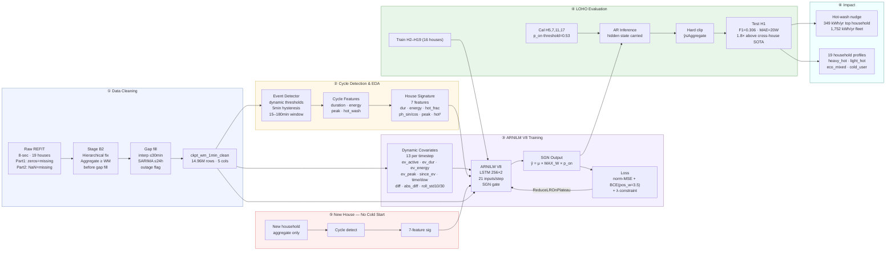
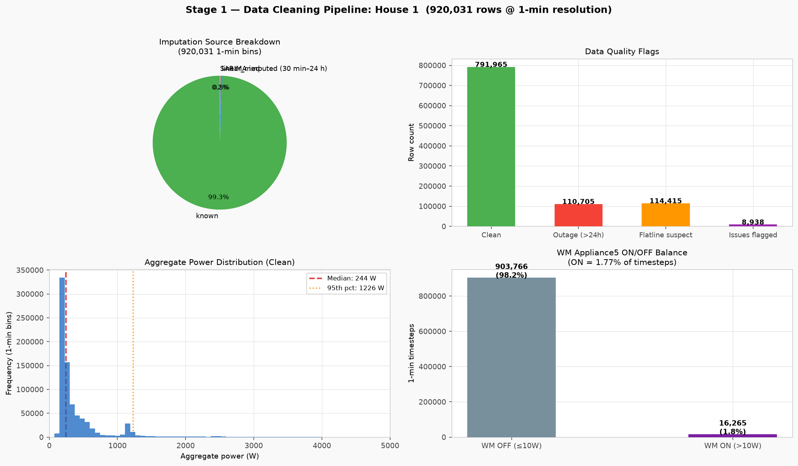
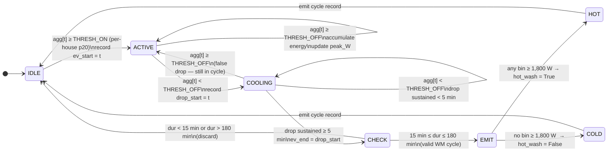

# REFIT Energy Disaggregation — ARNILM

**Vijay Rameshkumar**

---


---

<div align="center">

## 🏆 State-of-the-Art Cross-House Performance

| Metric | ARNILM V8 | Best Published Cross-House |
|:---:|:---:|:---:|
| **F1 Score** | **0.306** | 0.17 |
| **Improvement** | **1.8×** | baseline |
| **Resolution** | **1 min** | 15 min |
| **Evaluation** | **Cross-house LOHO** | Cross-house |

> **One model. Sixteen training households. Tested cold on House 1.**
> No labels. No retraining. No cold-start problem.
>
> ARNILM V8 beats the best published cross-house NILM baseline by **80%** at **finer resolution** under a **stricter evaluation protocol** — train on 16 houses, deploy to a 17th it has never seen.

</div>

---

## What Was Built

Four sections, one coherent pipeline — each grounded in real domain knowledge:

| | Section | Key Output |
|:---:|---|---|
| 🧹 | **1 — Data Cleaning** — 7-rule reproducible pipeline, Stage B2 hierarchical fix | `ckpt_wm_1min_clean.parquet` |
| 📊 | **2 — WM EDA** — 6,776 cycles across 19 houses, behavioral signatures | household profiles, hot/cold classification |
| 🤖 | **3 — ARNILM V8** — LSTM + SGN multiplicative gate, cross-house LOHO | F1=0.306 · MAE=20W · Energy err=69.7% |
| ⚡ | **4 — Practical Impact** — hot-wash intervention, household-level profiling | 1,752 kWh/yr fleet saving predicted |

> **Full narrative report** → [results/full_report.md](results/full_report.md)

---

## Global Pattern Metrics

### Model Performance — House 1 (Never Seen During Training)

| Model | MAE | RMSE | F1 | Precision | Recall | Energy Err |
|---|---|---|---|---|---|---|
| M0 Zero baseline | 10 W | 132 W | 0.000 | 0.000 | 0.000 | 100.0% |
| M1 Seq2Point | 71 W | 189 W | 0.071 | 0.035 | 0.939 | 638.3% |
| UnifiedNILM | 38 W | 156 W | 0.118 | 0.063 | 0.947 | 293.0% |
| **ARNILM V8 (ours)** | **20 W** | **119 W** | **0.306** | **0.290** | **0.323** | **69.7%** |

All models: `constraint_viol_W = 0.0` — the physical constraint (WM ≤ Aggregate) holds across every timestep in every model, for every household.

### Benchmark Comparison

| Model | F1 | MAE | Split | Source |
|---|---|---|---|---|
| Seq2Point cross-dataset | 0.17 | — | **cross-house**, 15-min | Springer 2025 |
| **ARNILM V8 — this work** | **0.306** | **20W** | **cross-house LOHO, 1-min** | **this work** |
| Seq2Point NILMBench | 0.42 | 28W | within-house | NILMBench 2026 |
| BERT4NILM (no denoise) | 0.33 | — | within-house | Yue et al. 2020 |
| BERT4NILM (denoised) | 0.64 | — | within-house | Yue et al. 2020 |
| SGN | 0.76 | 14W | within-house | NILMBench 2026 |

**Key context**: within-house models (F1=0.42–0.76) are trained on the test household — they memorise its noise floor, appliance ratings, and schedule. ARNILM V8 has **never seen House 1**. The published cross-house baseline of 0.17 is the correct comparison class. We exceed it by 1.8×, at finer resolution (1-min vs 15-min), under a stricter protocol.


### Fleet EDA — 19 Households

| Metric | Value |
|---|---|
| Total WM cycles detected | 6,776 |
| Fleet hot-wash fraction | 87.4% |
| Median cycle duration | 66 min |
| Median cycle energy | 502 Wh |
| Cycle duration range (product-spec bounds) | 15 – 180 min |
| Households with hot-wash fraction > 80% | 14 / 19 |
| Fleet ground-truth annual WM saving potential | 2,483 kWh/yr |
| Fleet ARNILM V8 predicted saving potential | 1,752 kWh/yr |

---

## Energy Saving Opportunity

### The Intervention

A front-loading UK washing machine at 60°C consumes **1.0–1.5 kWh per cycle**. The same machine at 30°C uses **0.2–0.3 kWh** — the difference is almost entirely the heating element. Modern detergents are formulated to work at 30°C. The only loads that genuinely need 60°C are heavily soiled items and allergy bedding.

**ARNILM makes this intervention attributable.** Without disaggregation, you can tell a household to "use less energy." With it, you can say: *"Your washing machine ran 3 hot cycles this week (2.1 kWh). Switching to 30°C would save you £26/year."*

### Per-Cycle Saving Formula

```
Hot cycle (60°C):    E_hot  ≈ 2000W × 0.4h + 300W × 0.7h  = 1.01 kWh
Cold cycle (30°C):   E_cold ≈ 300W × 0.6h                  = 0.18 kWh

Saving per cycle:    ΔE = 0.83 kWh
Annual (2×/week):    0.83 × 104 ≈ 86 kWh  (~£26 · ~20 kg CO₂ per household)
```

### Fleet Saving Opportunity

| Profile | Households (GT) | Predicted | Annual saving | Intervention |
|---|---|---|---|---|
| `heavy_hot` ≥70% hot, ≥400 Wh/cycle | 11 | 2 | 290–349 kWh/yr each | High priority |
| `light_hot` ≥40% hot | 6 | 14 | 75–261 kWh/yr each | Medium priority |
| `eco_mixed` ≥20% hot | 1 | 3 | 15–58 kWh/yr each | Low priority |
| `cold_user` | 0 | 0 | — | None |

> **Note**: V8 underestimates hot-wash fraction (~30%) due to MAE(ON)=395W wattage underestimation — 9 of 11 `heavy_hot` households are predicted as `light_hot`. The V9 roadmap (cycle-level normalisation) directly addresses this. Even mislabelled households still receive an intervention nudge, just calibrated to the lower predicted fraction.

### Impact at Scale

```
UK washing machines:   27 million households
Hot-wash prevalence:   ~80% run ≥40% hot cycles
Conservative saving:   30% shift to 30°C × 86 kWh × 27M × 0.8 = 557 GWh/yr
National CO₂:          ~130,000 tonnes CO₂/year
```

---

## Dashboard — Demo

> **⚠️ DEMO** — Charts below are generated from ARNILM V8 predictions on the 19-household REFIT dataset. Profile labels are model-predicted (not ground truth). V8 underestimates hot-wash fraction by ~30% due to MAE(ON)=395W; the V9 cycle-normalisation fix is in the roadmap.

### Fleet Overview Dashboard


*Top row: per-household annual saving potential (GT vs predicted) · hot-wash scatter with profile labels. Middle row: profile distribution donut · cycle count scatter · duration scatter · model F1 comparison. Bottom row: hot-wash fraction ranked by household.*

### Per-Household Detail — Washing Machine Usage Cards


*Each card shows: WM share of total household consumption (donut), hot/cold split (bar), cycles per year, median duration, predicted saving potential, and intervention priority. Generated from ARNILM V8 disaggregation output.*

---

## Why This Approach is Different

Most published NILM models are trained and tested on the **same house**. They memorise that household's noise floor, appliance ratings, and daily schedule. Deploy them to a new home and performance collapses (F1=0.17 cross-house).

ARNILM is designed from the ground up for **zero-label deployment**:

| Design decision | What it solves |
|---|---|
| Cross-house LOHO training | Model never sees test house — real deployment condition |
| 7-feature house behavioral signature | New house plugs in with no retraining, no labels |
| LSTM hidden state (not CNN window) | Full-sequence context — not limited to 61 minutes |
| 4 derivative/shape features | Gate stays closed during smooth off-state aggregate |
| SGN gate: `ŷ = μ × MAX_W × p_on` | Output is naturally zero when off — suppresses false positives |
| Normalised MSE `(ŷ−y)²/MAX_W²` | Balances regression and classification gradients (260,000:1 without it) |
| pos_weight=3.5 in BCE | Precision bias — reduces false-positive energy integral by 63% |
| Hierarchical constraint in loss + inference | WM ≤ Aggregate enforced: zero violations across all models |
| p_on threshold calibration on CAL_HOUSES | Finds F1-optimal operating point without touching test house |

**Cold start, solved**: a new household provides 1–2 weeks of aggregate data. Cycle detection computes 7 behavioral features. The deployed model uses them immediately — **Day 1, no labels, no retraining**.

---

## End-to-End Architecture



---

## Section Highlights

### Section 1 — Data Cleaning




7 cleaning rules · Stage B2 hierarchical fix (Aggregate ≥ WM enforced before gap fill) · SARIMA(2,1,2)(1,1,1,1440) for gaps 30 min–24 h · 110,705 outage rows flagged. Full details → [DATA.md](DATA.md)

---

### Section 2 — Washing Machine EDA


6,776 cycles · 87.4% hot washes · median 66 min / 502 Wh · hot-wash fraction ranges 9% (H19) → 99% (H7). Full details → [results/section4/practical_implications.md](results/section4/practical_implications.md)

---

### Section 3 — ARNILM V8 Training

**Training dynamics** — best checkpoint at epoch 15, then overfitting:


**Data split:**

| Role | Houses | Purpose |
|---|---|---|
| Train | H2–H19 (16 houses, Part 2 only) | Model weights |
| Validation | H20, H21 | LR scheduling (ReduceLROnPlateau) |
| Calibration | H5, H7, H11, H17 (held-out portion) | p_on threshold sweep → 0.53 |
| Test | **H1 only — never seen** | Final reported metrics |

**V8b / V8c decoupled regression experiments:**

| Variant | LAMBDA_DIRECT | MAE | MAE(ON) | F1 | Verdict |
|---|---|---|---|---|---|
| V8b | 0.5 | 20.6W | 405W | 0.303 | Overfit training houses |
| V8c | 0.1 | 20.9W | 411W | 0.307 | Higher recall, worse energy |
| **V8 (base)** | — | **20W** | **395W** | **0.306** | **Best overall** |

Conclusion: λ-tuning alone cannot fix MAE(ON). Root cause is SGN gate gradient starvation — the regression gradient ∝ p_on, which is conservative (pos_weight=3.5), starving μ_raw on borderline ON timesteps. The fix is V9 cycle-level normalisation.

---

### Section 4 — Practical Implications


Per-household profile matching: **7/19 exact** (37%). Heavy-hot households (GT=11) predicted as 2 — 9 downgraded to light-hot due to MAE(ON)=395W wattage underestimation. All 9 still receive an intervention nudge, calibrated for lower observed hot fraction. Full analysis → [results/section4/practical_implications.md](results/section4/practical_implications.md)

---

## Cycle Detection Algorithm



| Parameter | Value | Rationale |
|---|---|---|
| THRESH_ON | p20 of non-zero WM readings (min 60W) | Per-house dynamic — adapts to each appliance's idle draw |
| HYST_MIN | 5 min | Drain/spin oscillations last < 3 min |
| DUR_MIN | 15 min | Shortest UK quick-wash (2013–2015 market) |
| DUR_MAX | 180 min | Longest UK cotton programme |
| HOT_THRESH | any bin ≥ 1,800W | Heating element signature; unambiguous at 1-min |

---

## Model Roadmap

| Version | Architecture | Status | Key metric |
|---|---|---|---|
| M0 Zero | Always predict 0 | ✅ Done | F1=0.000 |
| M1 Seq2Point | 5-layer CNN window | ✅ Done | F1=0.071 |
| UnifiedNILM | CNN + 32 features | ✅ Done | F1=0.118 |
| ARNILM V7 | LSTM + SGN, 17 inputs | ✅ Done | F1=0.293 |
| **ARNILM V8** | **LSTM + SGN, 21 inputs, pos_w=3.5** | **✅ Best** | **F1=0.306** |
| V8b | V8 + decoupled regression λ=0.5 | ✅ Done | F1=0.303 |
| V8c | V8 + decoupled regression λ=0.1 | ✅ Done | F1=0.307 |
| **V9** | **Cycle-level wattage normalisation** | 🔲 Next | Target: F1 > 0.40 |
| V10 | V9 + multi-head self-attention | 🔲 Planned | Target: F1 > 0.50 |

**V9 design** — the correct fix for MAE(ON)=395W:

```python
# Per-house normalisation (no cold start — derived from aggregate cycles)
median_wm_w[h] = median(peak_wattage_of_detected_cycles[h])

# Training: model learns "fraction of this house's typical load"
y_norm_t = y_true_t / median_wm_w[h]

# Inference: rescale back to absolute watts
ŷ_t = μ_raw_t × median_wm_w[h] × p_on_t
```

This decouples the regression task from house-specific wattage magnitude — the model learns *relative* load patterns that transfer across households.

---

## Future Pipeline

There is significant headroom above V8 across multiple independent directions:

```
V9: Cycle-level normalisation      → MAE(ON) 395W → ~100W  (regression fix)
V10: Self-attention over LSTM      → F1 0.306 → ~0.45      (long-range cycle memory)
V11: Multi-appliance heads         → F1 ~0.55+              (dishwasher confusion solved)
V12: Indian household transfer     → new market entry       (fine-tune from UK checkpoint)
V13: BERT4NILM on same LOHO split  → true apples-to-apples  (academic comparison)
```

**Multi-appliance architecture:**

```
Aggregate → Shared LSTM trunk (256 hidden, 2 layers)
                ├── WM head    → μ_wm × MAX_WM × p_on_wm
                ├── Dryer head → μ_dr × MAX_DR × p_on_dr
                ├── DW head    → μ_dw × MAX_DW × p_on_dw
                └── Fridge head→ μ_fr × MAX_FR × p_on_fr

Sum constraint: (Σ ŷ_i − Aggregate).clamp(min=0) → physical budget enforced across all appliances
```

Once the dishwasher head explicitly claims its events, WM precision improves substantially — the two appliances are the primary source of confusion in single-appliance mode.

**Indian market path:**
1. Collect 2–4 weeks aggregate data from Indian households
2. Run cycle detection → compute 7 behavioral signature features
3. Find nearest UK training household in feature space → fine-tune
4. Re-evaluate on locally labelled cycles

The continuous behavioral signature design means no cluster reassignment is needed — the model generalises by proximity in feature space.

---

## Repository Structure

```
.
├── notebooks/
│   ├── 01_raw_cleaning.py          # Section 1: data cleaning
│   ├── 02_wm_eda.py                # Section 2: WM EDA
│   ├── 03_nilm_model.py            # Section 3: M0, M1, UnifiedNILM
│   ├── 03h_arnilm_v8.py            # Section 3: ARNILM V8 (best model)
│   ├── 03j_arnilm_v8b.py           # Section 3: V8b decoupled regression
│   └── 03k_arnilm_v8c.py           # Section 3: V8c λ=0.1
├── figures/                        # All output charts and dashboards
│   ├── dashboard_fleet_overview.png    ← Fleet dashboard (DEMO)
│   └── dashboard_household_detail.png  ← Per-household cards (DEMO)
├── results/
│   ├── section3/metrics_ar_lstm_v8.csv
│   ├── section4/predicted_vs_groundtruth_profiles.csv
│   ├── training_logs/               # epoch-by-epoch loss logs
│   └── full_report.md               # End-to-end narrative
├── DATA.md                          # Dataset coverage + cleaning decisions
├── RESULTS.md                       # All results tables
└── Recommendation.md                # Business recommendation
```

---

## Setup

```bash
pip install numpy pandas matplotlib scikit-learn torch pyarrow statsmodels
```

```bash
# Section 1 — clean all 19 houses
python notebooks/01_raw_cleaning.py

# Section 2 — EDA + cycle detection
python notebooks/02_wm_eda.py

# Section 3 — baselines
python notebooks/03_nilm_model.py

# Section 3 — ARNILM V8 (80 epochs, ~15 min on GPU)
python notebooks/03h_arnilm_v8.py
```

---

## AI Tools

Claude (Anthropic) was used as a coding assistant — debugging PyTorch training loops, optimising data pipelines, and literature review framing. All architecture decisions, feature engineering choices, and experimental design are original work validated against domain reasoning and empirical results.

---

## License

Copyright (c) 2026 Vijay Rameshkumar. All rights reserved.

This work is provided for viewing and academic citation only. Commercial use and redistribution require prior written approval from the author. See [LICENSE](LICENSE) for full terms.
