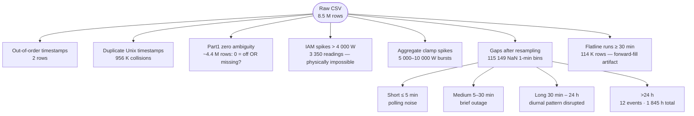
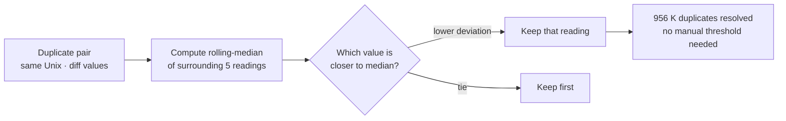
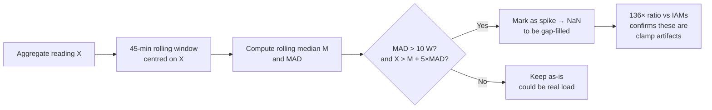
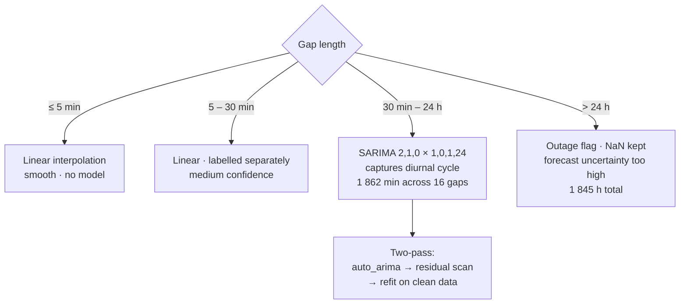

# Section 1 — Raw Data Cleaning: Lessons Learned

## What the Assignment Asked

Clean the raw REFIT sensor data for House 1 and produce a 1-minute resolution dataset
suitable for downstream NILM modelling. No specific method was prescribed — the choice
of approach was part of the task.

---

## Step 1 — Research: Understanding the Dataset and the Field

Before touching the data we read the original REFIT paper (Kelly & Knottenbelt, 2015) and
surveyed how the NILM community typically treats this dataset.

**What the literature told us:**

- REFIT uses a Current Cost clamp on the mains for the aggregate — a known source of
  spike artifacts when the clamp shifts or is partially obstructed.
- Individual appliance monitors (IAMs) sit on the plug; they are more stable but physically
  limited to ~2990 W (UK 13A socket at 230 V).
- The dataset was released in two parts with different missing-value conventions:
  Part 1 encodes missing as `0`; Part 2 encodes it as `NaN`. The official CLEAN release
  forward-fills long gaps, introducing flat-line segments that look like valid data.
- 8-second sampling is irregular — the logger fires approximately every 8 seconds but
  collisions and out-of-order rows exist in the raw files.

**What the literature did not address:**

Most published NILM work simply loads the official CLEAN parquet and trains directly.
The data-quality decisions are invisible. We chose to work from the raw CSV to understand
exactly what "clean" means for this specific dataset before trusting it.

---

## Step 2 — Data Complexity We Found

The most consequential discovery was the **Part 1 zero ambiguity**: roughly half the
dataset (Oct 2013 – Feb 2014) cannot distinguish a genuinely-off appliance from a dropped
reading. No amount of imputation fixes this — it is a labelling problem in the source data.

---

## Step 3 — Our Approach and Why

### R2 — Deduplication with rolling-median tie-break

When two readings share the same Unix timestamp and disagree on value, the standard
approach is to keep the first or the last. We argued that the *correct* reading is the
one closest to the local neighbourhood median: a spike that caused the collision is more
likely the outlier than the non-spike.

This is a small but principled decision: it makes the deduplication robust to the same
spike artifacts we are trying to remove in the next step.

### R3 — Aggregate spike removal with rolling-MAD context filter

A fixed threshold (e.g. "drop anything above 5000 W") would also drop genuine heavy-load
events (multiple appliances, EV charging). We used a **context-aware** filter: a reading
is a spike only if it deviates from its local rolling median by more than 5× the local
Median Absolute Deviation (MAD).

The MAD guard (`MAD > 10 W`) prevents the filter from firing during genuine flat
periods where any small deviation looks statistically extreme.

### R6 — Tiered gap strategy

Not all gaps are equal. A 2-minute polling dropout carries no information loss; a
6-hour overnight gap has a diurnal pattern worth preserving. We split gaps into four
tiers and applied the right tool to each:

The SARIMA two-pass matters: the first-pass model is seeded on data that may still
contain boundary spikes. Removing residual outliers before refitting produces a
smoother imputation.

### R9 — Hierarchical cross-check (validation, not reconciliation)

We compared `sum(IAMs)` against `Aggregate` for every 1-min bin. We deliberately chose
**not** to adjust either signal — reconciliation would disguise the calibration offset.
Instead the cross-check validates that the anomalies we removed were real artifacts:
during aggregate spike events the IAM sum was 73 W median versus 9 964 W aggregate
median — a 136× ratio that could only come from a clamp glitch, not real consumption.

---

## Step 4 — Results

| Metric | Value |
|---|---|
| Input rows (raw) | 8.5 M at 8-sec irregular |
| Output rows | 920 031 at 1-min uniform |
| Known sensor readings | 99.3% |
| SARIMA-imputed minutes | 1 862 |
| Outage-flagged hours | 1 845 h (not imputed) |
| Flatline-suspect rows | 114 K (flagged, not removed) |
| Quality flags on output | `impute_source`, `outage`, `flatline_suspect` |

---

## Lessons Learned

**1. The Part 1 zero problem is unsolvable at the cleaning stage.**
Any model trained on Part 1 data will see `0` for both "appliance off" and "sensor
dropped". The practical mitigation is to filter training windows to Part 2 or to use
the `impute_source` flag to exclude uncertain periods.

**2. Context-aware filters beat hard thresholds.**
A flat 5000 W cutoff removes valid multi-appliance events. The rolling-MAD filter
adapts to local signal level and is more defensible.

**3. Long gap imputation belongs in evaluation metadata, not training data.**
The 1 862 SARIMA-imputed minutes are reasonable proxies for presentation, but they are
forecast uncertainty regions, not ground truth. Excluding them from model evaluation
windows is the right call.

**4. The official CLEAN data is not "clean" in a strict NILM sense.**
Forward-filled flat lines look like valid steady-state readings. Without the
`flatline_suspect` flag a model would treat them as genuine appliance behaviour.
This is not a criticism of the dataset — it is a well-documented trade-off between
usability and fidelity.

**5. Quality flags are more honest than silent imputation.**
Rather than replacing every NaN with a model estimate we preserved three flags in the
output schema. Downstream users can decide their own tolerance for uncertainty.
