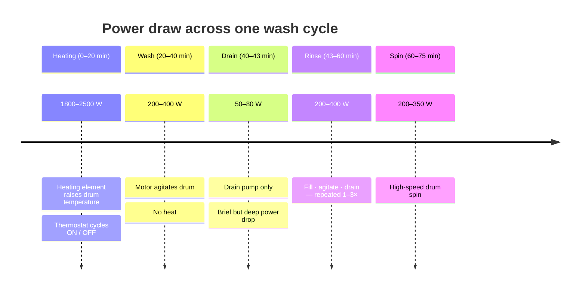
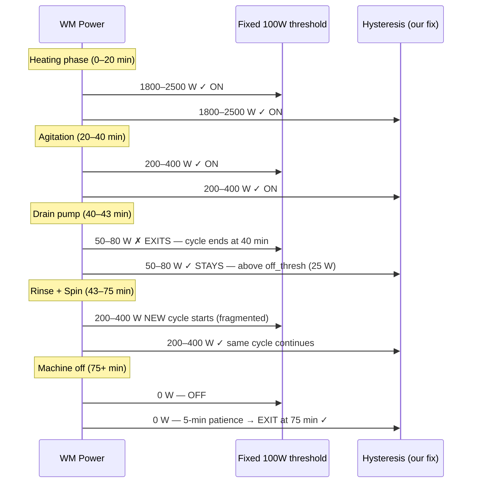
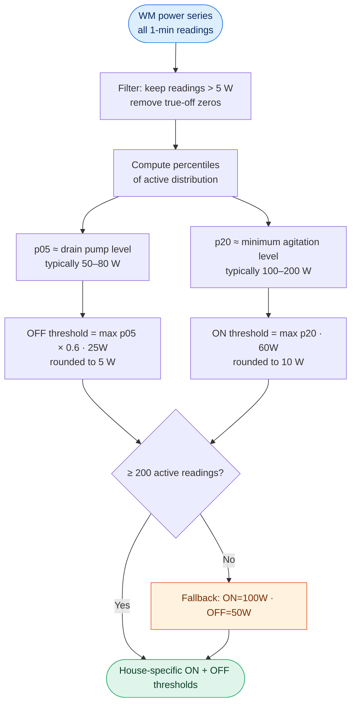
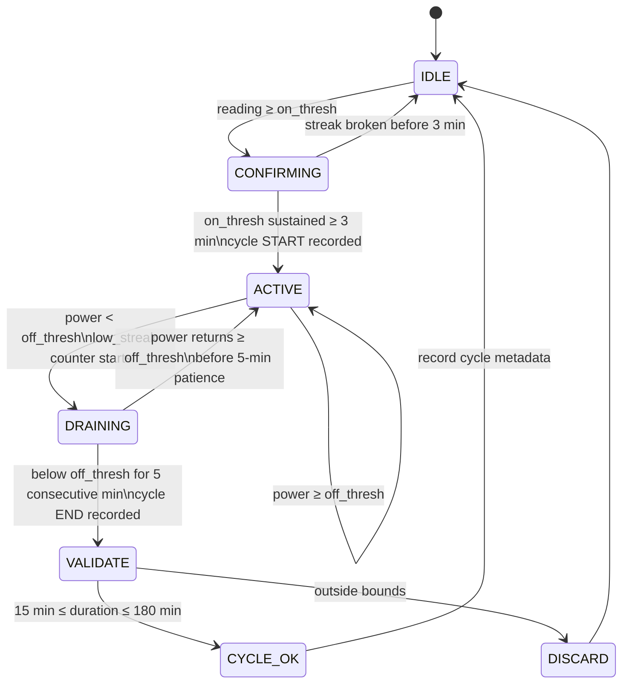
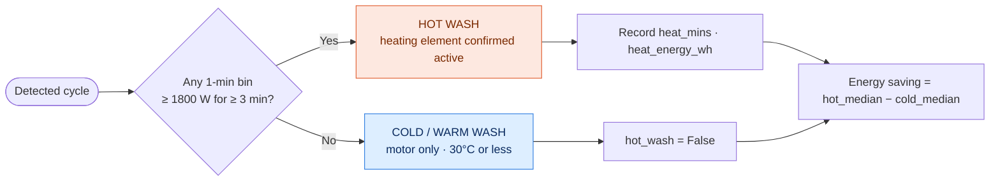

# Section 2 — Washing Machine EDA: Lessons Learned

## What the Assignment Asked

Explore washing machine usage patterns across all REFIT households: cycle frequency,
duration, energy consumption, hot vs cold wash behaviour, and time-of-use patterns.
Produce a cycle-level dataset suitable for Section 3 NILM work.

---

## Step 1 — Research: Understanding the Machine and the Market

A washing machine is not a simple on/off appliance — it cycles through distinct power
phases within a single wash programme. Before writing any detection code we mapped the
physical reality.

**Power phases in a typical UK front-loader (40°C cotton, 75 min):**

**UK market context (2013–2015, relevant to when REFIT was collected):**

We looked up dominant washing machine brands sold in the UK during the data collection
window: Beko, Hotpoint, Bosch, Indesit. The shortest wash programme on the market was
the **Bosch SpeedPerfect 15-minute** cycle. No domestic programme runs longer than
3 hours. These two facts gave us our minimum (15 min) and maximum (180 min) cycle bounds
— grounded in real products, not guessed from the data.

---

## Step 2 — Data Complexity We Found

### The drain-phase fragmentation problem

The most important discovery came from inspecting the *detected* cycle durations before
any tuning: the median was **19 minutes** instead of the expected 60–90 minutes.

A fixed 100 W ON/OFF threshold worked fine for the heating phase but treated the
2–4 minute drain pump (50–80 W) as the machine turning off. Every hot wash was
being split into a heating segment + a rinse/spin segment — neither of which is a
real cycle.

### Why House 5 was the clue

House 5 showed a median cycle duration of ~50 minutes under the broken algorithm.
It turned out to run 45% cold washes — programmes that stay at 200–400 W throughout
with no heating spike. Without a deep drain dip, the full cycle was captured. This
anomaly led directly to the diagnosis above.

### Variable machine signatures across 19 houses

Not all washing machines have the same idle power or standby draw. A 100 W ON threshold
that works for one machine may be too high for another with a weaker motor. We needed
per-house thresholds derived from each machine's own power distribution.

---

## Step 3 — Our Approach and Why

### Dynamic per-house thresholds

Instead of a single global threshold we derived ON and OFF thresholds from each
machine's active power distribution:

The key insight: the OFF threshold is set *below* the drain pump level (p05 × 0.6),
so the machine stays in the ACTIVE state during drainage. It only exits when the
drum has fully stopped and power returns to true standby (<25 W).

### Hysteresis state machine

Two thresholds without patience logic would still fail: a single 1-minute reading
below the OFF threshold would incorrectly end the cycle. We added a 5-minute patience
window (OFF_PATIENCE):

The 3-minute entry streak prevents transient spikes (kettle, microwave) from
triggering a cycle. The 5-minute exit patience bridges the drain phase (2–4 min)
with a safety margin.

### Hot vs cold wash classification

1800 W is the rated minimum for a UK front-loader heating element — below this, only
the motor is running. The 3-minute minimum prevents a brief spike from misclassifying
a cold wash.

---

## Step 4 — Results

| Metric | V1 (fixed 100 W) | V2 (hysteresis) |
|---|---|---|
| Total cycles detected | 3 502 | **6 776** |
| Median duration | 19 min | **66 min** |
| Median energy (cold wash) | ~50 Wh | **~200 Wh** |
| Median energy (hot wash) | ~537 Wh | **~500 Wh** |
| Hot wash fraction | 88.8% | **87.4%** |
| Energy saving hot → cold | 481 Wh/cycle | **401 Wh/cycle** |

The V1 numbers were physically wrong: 19-minute cycles and 50 Wh cold washes are not
washing machine cycles. The V2 numbers match what appliance manufacturers and
energy auditors report for UK households.

**Notable finding — House 19:** Only 9% hot washes. Nearly all cycles at 30°C or
cold. This is a genuine behavioural outlier across the cohort, not a detection error —
the machine's power trace confirms it.

**Usage timing:** Saturday 8–10 am is the busiest slot (2.1% of all cycles). Weekday
morning peak at 7–10 am. Tuesdays and Wednesdays noticeably quieter across the cohort.

---

## Lessons Learned

**1. Physical domain knowledge diagnosed the bug before the data did.**
We knew the drain pump runs at 50–80 W before we ran a single query. That knowledge
made the 19-minute median immediately suspicious rather than accepted.

**2. One outlier house can be a diagnostic gift.**
House 5's correct duration under a broken algorithm pointed directly to the cold-wash
vs hot-wash difference as the mechanism. Treating anomalies as signals rather than
noise accelerated the fix.

**3. Thresholds should come from the data's own distribution, not from intuition.**
A 100 W ON threshold was a reasonable starting guess. The data showed that wash
machines in this cohort have p20 active readings between 60–80 W — a 100 W threshold
was already clipping the low end of normal agitation. Deriving from percentiles makes
the threshold adaptive without adding complexity.

**4. "More cycles detected" is not automatically better.**
Going from 3 502 to 6 776 cycles looks like improvement — and it is — but the
right validation is whether duration and energy now match known appliance behaviour.
We validated against UK manufacturer cycle time specs, not just against V1.

**5. The hot/cold energy gap is the most actionable finding.**
A 401 Wh median saving per cycle translates to roughly 80–120 cycles per household
per year at 30°C instead of 40–60°C. That is a concrete recommendation for Section 4.
