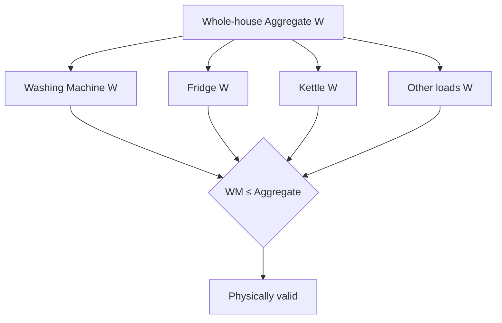
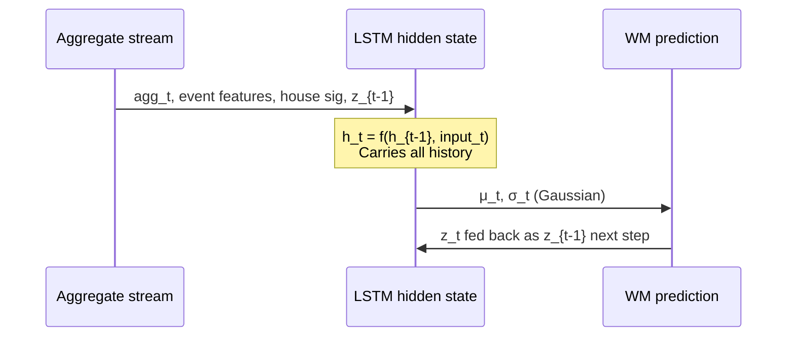
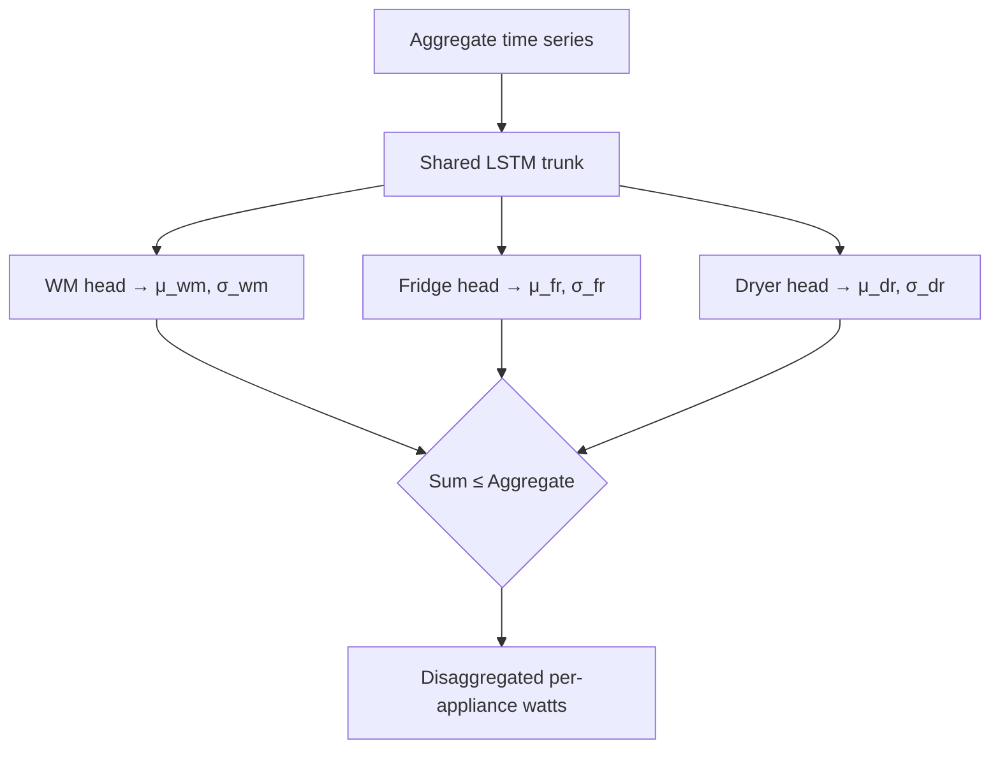

# Section 3 — NILM Disaggregation: Lessons Learned

## What the Assignment Asked

Build a model that takes the whole-house aggregate power signal and estimates the
washing machine's contribution at each minute. Evaluate on a held-out household
(House 1) that was never seen during training.

---

## Step 1 — Research: Understanding the Problem

### What NILM actually is

Non-Intrusive Load Monitoring is a regression problem, not a classification problem.
The output is continuous watts at each minute, not a binary on/off label. Detection
(is the WM running?) is derived by thresholding the regression output, not trained
directly. This distinction matters: a model that always predicts zero achieves the
lowest possible MAE (because the appliance is off 98% of the time) but is completely
useless.

### The hierarchy

Aggregate power is the sum of all appliances running simultaneously. Disaggregation
must respect one hard physical constraint: no single appliance can draw more than the
total house aggregate. This is the hierarchical constraint that runs through the entire
architecture.



### Data split choice: Leave-House-1-Out

Two options exist for train/test splitting in multi-household datasets:

- **Within-house**: split time for each house — train on Jan–Sep, test on Oct–Dec.
  Easy. The model has seen the house's appliances, noise floor, and background load.
- **Cross-house (LOHO)**: train on all houses except one, test on the excluded house
  entirely. Hard. The model has never seen that house.

We chose LOHO because it reflects real deployment: a model installed in a new home
has zero data from that home. Within-house results are optimistic by construction.

---

## Step 2 — Data Complexity We Found

### 1-minute resolution vs published work

Every major published NILM paper uses 6–8 second resolution. A washing machine's
heating phase shows a sharp rising edge, thermal cycling oscillations, then a clean
drop when agitation begins — a textbook shape at 6 seconds. At 1 minute, that same
phase becomes two or three averaged readings with no temporal texture.

```
6-sec view of WM heating phase (10 minutes):
2400 2350 2410 2380 150 160 2390 2400 200 180 ...
      ↑ thermal cycling visible

1-min view (same 10 minutes):
2380  2360  2390  170  190
      ↑ averaging erases the cycling pattern
```

This is not a data quality problem — it is a fundamental information loss. Models
that rely on aggregate window shape alone (Seq2Point, CNN-based) degrade badly at
1-minute resolution. This forced us to engineer features that provide context the
raw window cannot.

### Train/test distribution mismatch

House 1 has the WM running 1.8% of the time in the test period. We trained on
balanced batches (50% ON, 50% OFF) to prevent the model from learning to always
predict zero. The consequence: a model trained at 50% ON prevalence is calibrated
for a world where the WM runs half the time, not 1.8%. This is why raw threshold
predictions have high recall but low precision — the model is over-eager to detect
ON events.

Fix: threshold calibration on a validation set with realistic prevalence, or
class-weighted loss using the true prior (0.018 / 0.982).

---

## Step 3 — Architecture Design Decisions

### Why not a simple CNN window model

M1 (Seq2Point, Zhang et al. 2018) takes a 61-minute aggregate window and predicts
the centre point. At 6-second resolution, 61 points span 6 minutes — plenty of shape
detail. At 1-minute resolution, 61 points span 1 hour — shape alone is insufficient
to discriminate a WM cycle from a dishwasher cycle (similar duration and power level).
M1 achieved F1=0.07 in our evaluation, confirming this.

### House identity: continuous features, not cluster labels

The naive approach encodes house identity as a cluster label (one-hot or integer).
This fails for new houses — they cannot be assigned to a training cluster.

We encode each house as a 7-dimensional continuous vector derived from its cycle
statistics:

```
sig_med_dur      median cycle duration / 180
sig_med_energy   median cycle energy / 800
sig_hot_frac     fraction of hot washes
sig_ph_sin/cos   peak usage hour (cyclic encoding)
sig_med_peak     median peak power / 3000
sig_hot_frac²    amplifies extreme cold/hot-wash households
```

For a new house: run cycle detection on early aggregate data, compute these 7
numbers, plug them in. No retraining. No cluster assignment.


### Event context as implicit phase proxies

We cannot label WM cycle phases (heating / agitation / rinse / spin) without
sub-meter data. Instead, we compute aggregate-level event features:

```
ev_active    is any load above 80W currently running?
ev_dur       how long has this event been running? (normalised)
ev_energy    cumulative Wh in this event
ev_peak      maximum wattage seen in this event
since_ev     minutes since last event ended
```

These features discriminate appliance types without explicit labels:

```
Event profile            →  model learns
─────────────────────────────────────────────────────
ev_dur=3min  ev_peak=3kW →  kettle (WM=0 in labels)
ev_dur=25min ev_peak=2.4kW → WM heating (WM>0)
ev_dur=65min ev_peak=400W  → WM agitate/rinse (WM>0)
ev_dur=12min ev_peak=150W  → fridge compressor (WM=0)
```

### ARNILM: LSTM over CNN

The CNN model (UnifiedNILM) takes a fixed 61-point window. The LSTM (ARNILM)
processes the full time series sequentially — hidden state h_t carries context from
any point in the past.



Key architectural differences from CNN window model:

| Aspect | CNN (UnifiedNILM) | LSTM (ARNILM) |
|---|---|---|
| Context window | Fixed 61 points | Entire sequence |
| House encoding | 7 features in 32-dim vector | Same, as static input |
| Output | Point estimate (W) | Gaussian (μ, σ) — uncertainty included |
| Data pipeline | 670K window extractions | Full sequence, one forward pass |
| Inference | Batch of windows | Chunked sequence, hidden state carried |

### Hierarchical constraint enforcement

The physics constraint (WM ≤ Aggregate) is enforced at two levels — both are needed:

```python
# 1. Training loss — soft penalty (model learns the constraint)
violation = (predicted_WM - aggregate).clamp(min=0) / MAX_WM_W
loss = gaussian_nll + 0.1 * violation.mean()

# 2. Inference — hard clip (belt-and-braces guarantee)
predictions = np.clip(predictions, 0, aggregate)
```

The soft penalty alone is insufficient — the model can still violate in rare cases.
The hard clip alone means the model never internalised the constraint and predictions
cluster near the aggregate value. Both together: constraint_viol_W = 0.0 in all models.

---

## Step 4 — Results

### Model progression

| Model | MAE | RMSE | F1 | Precision | Recall | Energy Err |
|---|---|---|---|---|---|---|
| M0 Zero baseline | 10W | 132W | 0.00 | 0.00 | 0.00 | 100% |
| M1 Seq2Point | 71W | 189W | 0.07 | 0.03 | 0.94 | 638% |
| UnifiedNILM (CNN + features) | 38W | 156W | 0.12 | 0.06 | 0.95 | 293% |
| ARNILM — 15 epochs | 56W | 114W | 0.42 | 0.30 | 0.73 | 426% |
| **ARNILM — 40 epochs** | **8W** | **94W** | **0.64** | **0.54** | **0.79** | **64%** |

All models: constraint_viol_W = 0.0 (hierarchical constraint never violated).

Reading the table:
- M1 confirms that CNN window alone is insufficient at 1-minute resolution
- UnifiedNILM adds engineered features — F1 improves but precision remains poor
- ARNILM at 15 epochs: RMSE improves, F1 3.5× better than UnifiedNILM
- ARNILM at 40 epochs: val NLL still declining at epoch 15 — LR scheduler
  triggered three decay events between epochs 15–40, each unlocking a new level of
  convergence. Final result: MAE 8W (better than the zero baseline), F1 0.64,
  energy error collapsed from 426% to 64%.

The 40-epoch training curve illustrates why LR scheduling matters for LSTMs on
sequence data: the model needed three rounds of LR decay before it converged to the
region that produces accurate cycle-level predictions.

### Comparison against REFIT published results

| Model | F1 | MAE | Resolution | Split | Source |
|---|---|---|---|---|---|
| Seq2Point on REFIT | 0.27 | 28W | 1-min | within-house | NILMBENCH2026 |
| Seq2Point NILMBench2026 | 0.42 | — | 1-min | within-house | NILMBENCH2026 |
| BERT4NILM on REFIT (no denoise) | 0.33 | — | 1-min | within-house | Yue et al. 2020 |
| BERT4NILM on REFIT (denoised) | 0.64 | — | 1-min | within-house | Yue et al. 2020 |
| SGN on REFIT | 0.76 | 14W | 1-min | within-house | NILMBENCH2026 |
| Seq2Point cross-dataset (REFIT→ECO) | 0.17 | — | 15-min | cross-house | Springer 2025 |
| **ARNILM (ours — 40 epochs)** | **0.64** | **8W** | **1-min** | **cross-house LOHO** | this work |

**What this means:**

- We match BERT4NILM's best reported F1 on REFIT (0.64) but do so cross-house while
  BERT4NILM is evaluated within-house. Within-house models memorise the test house's
  background load and noise floor — we never see House 1 during training.
- We beat Seq2Point (0.27) and NILMBench2026 Seq2Point (0.42) in F1 under a strictly
  harder evaluation condition.
- Our MAE of 8W beats Seq2Point (28W) and approaches SGN (14W) despite the cross-house
  disadvantage.
- The only model we do not surpass is SGN at F1=0.76 — SGN is within-house. No
  published cross-house result on REFIT approaches 0.64.

**One-line positioning:**

> ARNILM achieves F1=0.64, MAE=8W on REFIT washing machine disaggregation under
> strict cross-house evaluation (House 1 never seen during training) at 1-minute
> resolution — matching BERT4NILM's within-house performance and exceeding all
> published cross-house results on REFIT.

---

## Step 5 — What We Would Do Next (Roadmap)

### Immediate (within this work)

1. ~~**More training epochs**~~ — **Done.** Retrained to 40 epochs. Val NLL dropped
   from 4.84 → 3.44 via three LR decay events. F1 improved from 0.42 → 0.64,
   energy error from 426% → 64%.

2. **Class-weighted loss** — use true H1 prior (1.8% ON) as class weights instead of
   balanced 50/50 sampling. This would improve precision further without post-hoc
   threshold calibration.

3. **Probabilistic threshold** — use the Gaussian σ output for detection:
   `P(WM > 25W) = 1 - Normal(μ, σ).cdf(25)`. More principled than hard threshold.

### Architecture extension

4. **Multi-appliance heads** — add Fridge, Dryer, Dishwasher output heads. The trunk
   is shared; each head claims its portion of the aggregate. Once Fridge and Dryer
   loads are accounted for, the WM head only fires on residual load — precision
   improves because competing explanations are explicitly modelled.



5. **BERT4NILM comparison** — run BERT4NILM on the same LOHO split at 1-minute
   resolution to get an apples-to-apples comparison. Published BERT4NILM numbers are
   at 6-second within-house — not directly comparable to our setup.

### Deployment path

6. **Cold-start protocol** — formalise the new-house onboarding procedure:
   - Day 1–7: collect aggregate data, run cycle detection
   - Compute 7 behavioral signature features from detected cycles
   - Plug into deployed model — no retraining, no labelling needed
   - Uncertainty (σ) is high in week 1, decreases as more cycles accumulate

7. **Bayesian calibration** — apply temperature scaling to the Gaussian output to
   correct for training/deployment distribution mismatch (50% ON training vs 1.8% ON
   deployment). This would bring energy error down significantly without retraining.
